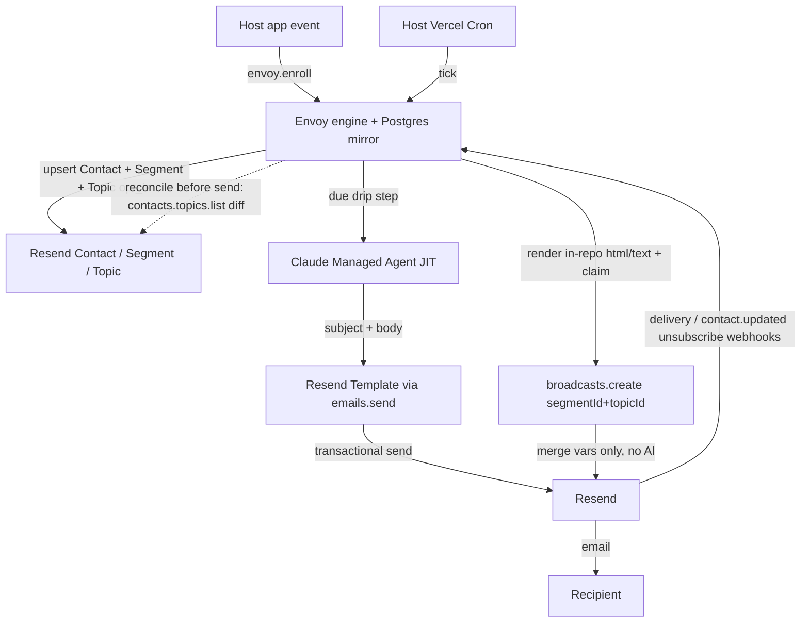

# Envoy v2 — Headless Drip-Email SDK on Resend

## Summary

Add a new, standalone **`@envoy/sdk`** package **alongside** the existing Envoy app in this repo — a **headless, bring-your-own-Postgres SDK** that an indie SaaS developer drops into their own Next.js (App Router) project. The existing Envoy app is **untouched** and keeps working exactly as today (AWS SES, OAuth, the visual email builder, its admin UI, its migrations); the SDK is a separate, self-contained package that shares no runtime code with the app and modifies none of its files. (Later the app may itself adopt the SDK — explicitly out of scope here.) In the SDK, Resend is the email surface — its Templates shell the drip lane, its Contacts/Segments/Topics hold the audience, its Broadcasts power the blast lane, and its API is the transport (the SDK targets `resend@^6.14.0`). The SDK provides what only Envoy does: a drip engine (enrollment, sequence state, time-based steps) and just-in-time per-recipient personalization via Claude Managed Agents.

The product runs two clearly separated send lanes. The **drip lane** sends individual transactional emails (`emails.send`), each with an AI-written subject and body injected into a host-authored Resend Template, advanced by a single host-wired cron. The **broadcast lane** sends a Resend Broadcast to a Segment (optionally narrowed to a Topic) with merge variables only — no per-recipient AI; because Resend Broadcasts accept no `templateId`, Envoy fetches the Resend Template via `templates.get`, fills it in code, and pushes `{ html, text }`. The host owns auth and the UI; Envoy ships typed server functions, React hooks, a mountable route handler, SQL migrations, and a retained MCP server so AI agents can operate the whole lifecycle.

## Problem Frame

Today's Envoy is a self-contained application: it owns its own OAuth 2.1 server and login, an `organization_id` multi-tenancy model, a custom visual email builder (`lib/block-compiler.ts`, `lib/template-engine.ts`, design-templates), an AWS SES transport with an SNS webhook stack, and its own admin pages. **That app stays exactly as it is** — this work does not touch it. The problem is that none of it is *importable*: an indie developer who already has a Next.js app, their own users, their own auth, and a Resend account cannot adopt any of Envoy's value incrementally — it is all-or-nothing, and most of the app duplicates infrastructure they already run.

The same developer's actual gap is narrow: they can send email with Resend, but they have no engine for *multi-step, time-based, per-recipient-personalized* sequences triggered by their own product events. That engine — plus AI that writes each message — is the only part worth importing. The app's auth, tenancy, visual templating, and SES integration are not part of the SDK — not because they are deleted (the app keeps them), but because a host already runs their own. The SDK is a new, minimal package that ships only the engine.

**Evidence & validation (open).** Building the SDK is a bet, not measured demand: the gap above is asserted without current-Envoy adoption/churn, support requests, or design-partner signal. The approach here — a separate package **alongside the intact app** — is deliberately the low-cost path (no app rewrite, no deletions, no migration risk to the running product). Still validate cheaply: ship the differentiated **drip lane** to a design partner and confirm indie devs will pay the setup cost for AI-per-recipient drips before building the full broadcast surface. The broadcast lane sequences *after* the drip wedge is proven, not alongside it. Because the app no longer dogfoods the SDK (it stays on its own stack), ship a thin internal example app under `packages/sdk/example/` that the authors run against a real Resend account — so the compliance-critical primitives (consent mirror, send-once claim, unsubscribe) are exercised by the authors, not only by the single external design partner.

## Key Decisions

- **A separate in-repo package; the existing app is untouched.** The SDK ships as a self-contained package directory in this repo (`packages/sdk/`) with its own `package.json`, `tsconfig`, build, and migrations. It imports no existing app code, and the app's `app/`, `lib/`, `migrations/`, build, and deploy are unchanged. The two coexist; a future, separate effort may make the app consume the SDK (out of scope). Everything below describes the SDK only — where it "drops" a capability the app has (auth, SES, the visual builder), that means the SDK simply doesn't include it, not that anything is removed from the app. **Accepted tension:** the repo now carries two independently-maintained email stacks (app on SES/OAuth, SDK on Resend/host-auth) that share no code by R48 — a cross-cutting fix (e.g. a suppression-ordering bug) is authored twice until the deferred "app adopts the SDK" effort converges them. That dual-maintenance cost is the deliberate price of the low-risk, no-rewrite path.

- **Headless, not batteries-included.** No pre-built admin UI ships. "Manage the lifecycle" means typed server functions, React hooks for reading state, and the MCP server for agent-driven operation — the host builds its own screens or drives Envoy through an agent. This is a deliberate trade against the literal "mount an admin" framing: indie Next.js devs want unopinionated primitives, like they use Resend's API directly. **Accepted tension:** an indie dev who wanted "drop in and move on" must still build screens to observe sequence/contact state — a real cost. Three things make the SDK observable without a shipped UI: the read-only hooks (R4), the MCP server as an agent-operable console (R25), and the deferred optional admin-UI kit. If adoption signal shows the no-UI bar is too high, the admin kit moves into v1.

- **Bring-your-own Postgres.** The SDK ships SQL migrations the host applies to their existing database (Neon/Supabase/etc). Envoy owns a bounded set of tables there. No Envoy-hosted backend, preserving the self-host / open-source ethos.

- **Two send lanes, never merged.** Per-recipient AI bodies cannot ride a Resend Broadcast (one email fanned out to a Segment), so personalized drips go through individual `emails.send` calls and Broadcasts stay a coarse merge-var bulk lane. The lanes also differ in template source by SDK constraint: the drip lane may reference a saved Resend Template id (`emails.send` accepts `template`); the broadcast lane must fetch the Resend Template via `templates.get`, fill it, and push `{ html, text }` because `broadcasts.create` accepts no `templateId`. Both share Contacts/Segments and the suppression mirror; they are distinct SDK surfaces.

- **Templates own the shell; AI fills declared slots (drip), broadcasts render in-repo.** For the **drip lane**, the host authors a Resend Template and references it by id; per step the host declares which slots the AI fills (any of subject, preheader, body, CTA copy), injected as Resend Template variables via `emails.send({ template })`. For the **broadcast lane**, because `broadcasts.create` has no template arm, the shell is a Resend Template read back via `resend.templates.get`, filled in code, and pushed as `{ html, text }`; per-recipient fields are Resend merge tags only, no AI. (Both lanes thus source their shell from a Resend Template — one source of truth; only the wire differs: `emails.send({ template })` for drip, fetch-fill-push for broadcast.) The SDK includes no visual builder; the app's `block-compiler`/`template-engine`/design-templates are untouched and simply not part of the SDK.

- **Shipped as `@envoy/sdk` on public npm.** A scoped, semantically versioned, open-source package — avoids name collisions and signals the SDK entry point.

- **Host owns auth; single tenant.** The route handler delegates authorization to a host-provided `authorize(req)` callback. The SDK ships no auth of its own — no OAuth, no login, no `organization_id` multi-tenancy (the existing app keeps all of those); one SDK installation is one implicit tenant.

- **Event-driven enrollment over Contacts/Segments/Topics.** Contacts enter via `envoy.enroll({ email, data }, sequenceKey)` called from the host's own app events (signup, trial-end, etc). Envoy mirrors a minimal contact for drip state, upserts it as a global Resend **Contact**, adds it to a configured base **Segment**, and — when the sequence/broadcast targets a logical sub-audience — sets the relevant **Topic** subscription via `resend.contacts.topics.update`. Audiences are not used (deprecated). The host's events are the trigger, not membership.

- **One cron, just-in-time generation.** Due steps fire from a single host-wired Vercel Cron hitting the mounted route; the AI body is generated at send time, not pre-computed. Freshest personalization, one setup step, and it keeps time-based ("wait N days") steps working since the cron is the clock.

- **Broadcast lane = imported primitives, host owns the clock.** Envoy ships the dangerous, stateful broadcast mechanics — send-once claim+resume, per-topic reconcile, dual-stream consent mirror, Resend Contact/Segment/Topic sync, render+dispatch — as composable primitives, plus a declarative `defineBroadcastProgram` handle and a `runIssue()` convenience that bundles the proven `reconcile → claim → render → send → advance` ordering (raw primitives stay exposed for custom ordering). The host owns *policy*: its own separate cron (the clock), its content query (what is new), and its eligibility predicate (who). This imports the ~600 lines a host otherwise gets wrong, without making Envoy own cadence policy or become a correctness-critical dependency for the host's compliance posture. The broadcast cron is always separate from the drip cron. **Why not just call `resend.broadcasts.create` directly?** A raw broadcast has no send-once guard (Resend exposes no broadcast idempotency key), no consent reconcile against Resend's global-contact model, and no `List-Unsubscribe`/suppression wiring — those are the ~600 lines this lane imports. The lane is therefore an *adjunct* for hosts already running the drip engine who want their broadcasts to share one authoritative consent mirror; a host that only wants an occasional bulk blast and runs no drips has little reason to route through Envoy and should call Resend directly. This is a deliberate, scoped part of the SDK's identity, not a standalone product — and it sequences after the drip wedge (see Problem Frame).

## Actors

- A1. **Host developer** — integrates the SDK: applies migrations, mounts the route handler, calls `enroll()` from app events, builds admin screens, authors Resend Templates, wires the cron.
- A2. **Email recipient** — the host's end user who receives drip and broadcast emails and can unsubscribe.
- A3. **Envoy SDK** — the drip engine: enrollment, sequence/step state, the cron tick, orchestration of generation and sends.
- A4. **Resend** — contacts (global Contacts), grouping (static Segments), preference granularity (Topics, `opt_in`/`opt_out`), email shells (Templates, drip lane only), bulk send (Broadcasts), transactional transport, and delivery/contact webhooks.
- A5. **Claude Managed Agent** — produces per-recipient subject/body from contact data and a per-step brief.
- A6. **AI agent over MCP** — operates the lifecycle (create sequences, enroll, inspect analytics) through the retained MCP server; the primary management surface given the headless decision.

## Data flow

## Requirements

### SDK surface & integration

- R1. Envoy is published as an installable npm package importable into a Next.js App Router host, with no Envoy-hosted backend or service dependency.
- R2. The SDK provides a route-handler factory the host mounts at a single catch-all route; that handler serves the SDK's API surface, the Resend webhook receiver, and the MCP endpoint.
- R3. The SDK exposes typed server functions for the full lifecycle — at least enroll, sequence management, broadcast triggering, contact lookup, and analytics reads — callable from host server code.
- R4. The SDK exposes read-only React hooks (`useProgramState`, `useConsent`, `useBroadcastHistory`, `useAnalytics`) that fetch through the mounted route's read API — the same state the server functions (R3) expose — so the host can build its own admin screens. They are read-only (writes go through server functions/actions), and the concrete fetch strategy (RSC vs SWR vs fetch) is a planning decision. No pre-built admin UI is shipped.
- R5. The SDK ships SQL migrations the host applies to their own Postgres; Envoy owns a bounded, documented set of tables.

### Auth & tenancy

- R6. The route handler authorizes requests through a host-provided `authorize(req)` callback; Envoy ships no login, session, or OAuth surface. Authentication is **per sub-path**, not uniform: the API + read endpoints run `authorize(req)`; the cron sub-path is gated by a `CRON_SECRET` (R40), the webhook sub-path by Svix signature (R41), the one-click unsubscribe by its signed token (R33), and the MCP sub-path by its own credential (R42) — each independently authenticated, since cron/webhook/unsubscribe callers cannot supply host session cookies. The plan produces an explicit auth-mechanism-per-sub-path table.
- R7. No runtime multi-tenancy — no `organization_id`. One logical installation serves one tenant; co-tenanting multiple end customers in a single installation is unsupported and unsafe (the SDK has no `organization_id` WHERE-clause isolation, so a host `authorize(req)` bug exposes the whole mirror, not one slice). The per-install namespace (R38) is the enforcement of this invariant, not a contradiction of it.

### Contacts & enrollment

- R8. The host enrolls a contact via `envoy.enroll({ email, data }, sequenceKey)` invoked from its own application events.
- R9. Envoy mirrors a minimal contact record (email, arbitrary host-supplied JSON data, Resend contact reference, and per-sequence enrollment/step state) in its Postgres tables.
- R10. On enroll, Envoy upserts the contact as a global Resend Contact, adds it to the configured base Segment, and sets any relevant Topic subscriptions, so the same contact is reachable by the broadcast lane.
- R11. Enrollment is idempotent: calling `enroll()` for a contact already active in the sequence is a no-op that returns the existing enrollment and sends nothing new.

### Drip lane

- R12. A sequence is an ordered set of steps; each step references a Resend Template by its Resend Template id, a per-step personalization brief, and a declaration of which slots the AI fills for that step.
- R13. Each drip step sends an individual transactional email through Resend (not a Broadcast).
- R14. The slots a step declares (any of subject, preheader, body, CTA copy) are generated just-in-time at send time and injected as Resend Template variables; the referenced Template must expose those variables and owns all other visual structure (logo, layout, links, footer).
- R15. Steps support time-based waits ("wait N days/hours") resolved against the cron clock.
- R16. A generation or send failure fails safe: the step is retried on a later tick, never sent empty and never silently dropped.

### Transactional send (one-shot, non-AI)

- R46. A one-shot transactional send: `envoy.send.transactional({ email, templateId, variables, stream, idempotencyKey? })` sends a single templated email via `emails.send` — distinct from the AI drip engine (no enrollment, no sequence, no AI generation). `stream` is **required** — it scopes the `List-Unsubscribe` token (R33); a call with no stream is rejected at config time (R45), never sent with a malformed or omitted unsubscribe. It consults the suppression mirror first, sets the RFC 8058 `List-Unsubscribe` one-click headers pointing at the SDK-owned topic-scoped landing (R33), and forwards Resend's `emails.send` idempotency key for exactly-once. This is the clean import for welcome / confirmation / receipt emails whose shape the drip-sequence engine does not fit — closing the gap where a host would otherwise call `resend.emails.send` directly.

### Broadcast lane

- R17. The host can send a Resend Broadcast via an SDK server function (`envoy.broadcast.send(...)`) that targets a Resend Segment (`segmentId`, required) and optionally narrows delivery to a Topic within that segment (`topicId`). Audiences are not used; `segmentId` is the canonical target (`audienceId` is a deprecated Resend alias and is not part of Envoy's surface).
- R18. The broadcast shell is a **Resend Template** — the single source of truth (authored in the Resend dashboard, or published from a repo definition via `templates.create`/`update`). Envoy reads it back with `resend.templates.get(id)` (which returns the template's `html`/`text` + variables), fills the template's variables in code, and passes the resulting html/text to `resend.broadcasts.create({ html, text })` — Resend Broadcasts accept no inline `templateId`. Because the broadcast path does **not** run Resend's template-variable substitution (that is an `emails.send` feature), Envoy does the fill itself and leaves only per-recipient values as Resend broadcast merge tags (e.g. `{{{FIRST_NAME|there}}}`, `{{{RESEND_UNSUBSCRIBE_URL}}}`). The fetched template is cached. No per-recipient AI in the broadcast lane.
- R19. The drip and broadcast lanes are distinct, separately invoked SDK surfaces. They share Resend Contacts/Segments and both source their shell from a Resend Template, differing only in the wire: the drip lane sends individual `emails.send` calls referencing the Template by id; the broadcast lane fetches the Template via `resend.templates.get`, fills it in code, and pushes `{ html, text }` because `broadcasts.create` accepts no `templateId`. Both lanes consult the same suppression mirror before sending.

### Execution

- R20. The SDK ships a cron handler; the host wires exactly one Vercel Cron entry to the mounted route to drive it.
- R21. Each cron tick finds due contacts, generates JIT, sends, and advances step state; it is safe under overlapping or retried ticks (no double-send).
- R22. Resend `email.*` events (delivery, bounce, complaint, open, click) and `contact.*` events (created/updated/deleted) are received through the mounted webhook handler and update analytics and suppression state. Per-topic state is resolved out-of-band (see R29), since the `contact.updated` payload carries no `topic_id`.

### Personalization

- R23. Per-recipient personalization runs through Claude Managed Agents, reimplementing the pattern from the app's `lib/agent-session.ts` in SDK-owned code (R48 — no import of app modules), using the contact's data plus the step brief.
- R24. Agent configuration (agent id, environment) is SDK-level configuration provided by the host, not per-tenant database state.

### Agent operation & compliance

- R25. An MCP server is retained, re-pointed at the new SDK internals and mounted through the route handler, so AI agents can operate the full lifecycle — the primary "management" surface given the headless decision.
- R26. Envoy's local mirror is **authoritative for Envoy's own send gating**: every send (drip and broadcast) consults the mirror first. The mirror converges with Resend via contact webhooks (R29) and a pre-send reconcile sweep, using a monotonic rule — `unsubscribed` dominates on either side, so an active state never overrides an unsubscribed one. A suppressed contact has its active drips halted and is excluded from broadcast assembly, across both lanes. The global flag (`unsubscribed=true`) is set only when a recipient explicitly chooses "unsubscribe from everything" on Resend's preference page — a correct suppress-all. The common case, a per-topic opt-out, leaves `unsubscribed=false` and is reconciled per-topic (R29), so per-topic granularity is preserved on **both** lanes: broadcast via Resend's topic-scoped preference page (R27), drip via the SDK-owned landing (R33).

### Resend integration model (Segments / Topics / Broadcasts)

- R27. Topics are first-class and model the unsubscribe gate. Each unit a recipient should be able to leave independently is one Resend Topic, created `defaultSubscription: 'opt_in'` and **public** (so it appears on Resend's hosted preference page). Granularity breaks up by **type of email** (the stream — e.g. digests vs alerts; Resend literally labels Topics "types of email") **and by subject** (e.g. per country): a Topic per `(stream, subject)` where that resolution matters — e.g. `digest:IT`, `digest:FR`, `alert:law-change` — so a recipient can drop one type/topic on the preference page while keeping the rest. Envoy provisions Topics idempotently, caches each `topicId`, and every broadcast carries `{ segmentId, topicId }` so Resend scopes its native unsubscribe to that Topic. `defaultSubscription` is immutable after creation. This granular-Topic model + Resend's native preference page **is** the topic-scoped unsubscribe gate — Envoy does not build a parallel broadcast-unsubscribe surface.
- R28. Per-topic consent mirror — the consent gate. The contact mirror stores per-topic subscription state (`topicId → opt_in|opt_out`) alongside the global suppression flag, not a single unsubscribe boolean. Subscribe/unsubscribe writes the mirror first (authoritative) then pushes to Resend via `resend.contacts.topics.update`; the unsubscribe push is awaited/confirmed before the operation reports complete (not fire-and-forget), because broadcast delivery is governed by Resend's own Topic membership at fan-out. This mirror is the **gate every send consults** (R26), and it is kept in sync with Resend's hosted topic preferences by the reconcile sweep (R29) — so a recipient's choice on Resend's preference page and an in-app preference toggle converge to the same authoritative per-topic state.
- R29. Contact webhook + per-topic reconcile (behavioral contract). The mounted handler ingests `contact.created|updated|deleted`. Because `ContactEventData` carries only a global `unsubscribed` boolean + `segment_ids[]` — no `topic_id`, and Resend emits no `topic.*` events — a `contact.updated` is a change signal only. On it Envoy resolves `email|id → contact`, calls `resend.contacts.topics.list`, diffs the returned subscriptions against the stored mirror snapshot, and writes `opt_out` for exactly the topic(s) that flipped; a global `unsubscribed=true` suppresses the contact across all topics. The same diff runs as a reconcile sweep immediately before each broadcast assembly, and **also verifies/repairs base-Segment membership** (not only Topic opt-state), because broadcasts target `{ segmentId, topicId }` as an intersection — a contact opted-in on the Topic but missing from the Segment silently receives nothing. The contract: a missed or late webhook does not cause a suppressed contact to receive a broadcast *at assembly time* — but Resend resolves fan-out membership at its own send time, **after** `broadcasts.create` returns, so reconcile **narrows but does not close** the window (an unsubscribe landing between the sweep and fan-out, widened further under `scheduledAt`, can still mail one issue — see Known compliance residuals). The sweep's cost-control mechanics (dirty-set narrowing, resumable full-sweep cursor, 429 backoff) are deferred to planning.
- R30. Broadcast send-once guard (external) + crash-safe resume. `resend@6.14.0` exposes no idempotency key on `broadcasts.create`/`broadcasts.send` (idempotencyKey is scoped to `emails.send`/`emails.batch` only). Every broadcast is guarded by an external claim row keyed on a host-supplied `broadcastKey`: an atomic `INSERT … ON CONFLICT DO NOTHING`, proceed only on a won claim, persist the returned Resend broadcast id, and treat a pre-existing unsent claim as a resumable prior attempt rather than a duplicate. Success is derived from rows affected, not a driver `rowCount`. **Resume must not double-blast:** a crash *after* Resend accepts the broadcast but *before* the id persists leaves `sent_at IS NULL`, so the broadcast is created with a deterministic `name = ${broadcastKey}` and the resume path first calls `broadcasts.list`/`get` to check whether that named broadcast already exists before re-creating — there is no idempotency key to absorb a blind replay. (`name` is a Resend display string with no server-side uniqueness enforcement; the `broadcasts.list` precheck, not the name, is the dedup. The atomic claim-on-conflict + claim-before-send ordering is the concurrency guard for overlapping ticks — this is a fixed contract, not a deferred decision.)
- R31. Segments/Contacts/Topics, not Audiences; version pinned. Envoy targets `resend@^6.14.0` and uses the Contacts + Segments + Topics model exclusively. `resend.audiences` and the `audienceId` broadcast option are deprecated and must not appear in Envoy code except as tolerant inbound webhook compatibility (`ContactEventData.audience_id`/`segment_ids` are read, not required). All broadcast targeting uses `segmentId` (+ optional `topicId`). Resend Segments are static lists (no rule engine), so membership is set explicitly on enroll, not via dynamic filters.
- R32. Broadcasts resolve to html in-repo from a Resend Template. The broadcast lane never sends a Resend `templateId`; it fetches the Template via `resend.templates.get` (returns `html`/`text`), substitutes the template's variables in code, preserves per-recipient Resend merge tags verbatim, and passes html/text to the single-call `broadcasts.create({ …, send: true, scheduledAt? })` form (6.14.0) to create and dispatch atomically. The fetched Template is cached to avoid a `templates.get` per send. (Resend remains the runtime source of truth for the shell; an optional repo→Resend publish flow is deferred — see Scope Boundaries.)
- R33. List-Unsubscribe compliance, split by lane (corrected for the Resend SDK surface). `CreateBroadcastBaseOptions` exposes **no `headers` field** (only `emails.send` does), so the SDK **cannot** inject `List-Unsubscribe` headers into a broadcast. The lanes therefore differ:
  - **Drip / transactional lane:** Envoy sets `List-Unsubscribe` + `List-Unsubscribe-Post: List-Unsubscribe=One-Click` (RFC 8058) via `emails.send` headers, pointing at an **SDK-owned landing** that maps one-click to a **topic-scoped** `opt_out`, using a signed per-`(contact, topic, stream)` token and a dedicated unsubscribe secret. Tokens are HMAC-SHA256 with a mandatory expiry (≥ 60 days per CAN-SPAM/RFC 8058); the landing rejects expired/forged tokens, is rate-limited, and returns uniform responses (no valid-vs-invalid oracle).
  - **Broadcast lane:** uses Resend's **native** unsubscribe (the `{{{RESEND_UNSUBSCRIBE_URL}}}` link / hosted preference page) — confirmed **topic-scoped**, no header needed. Because every broadcast carries a `topicId` (R27) and Topics are public, the preference page lets the recipient *"Unsubscribe from certain Topics (types of email)"* — a topic-scoped `opt_out` that keeps their other topics — **or** *"unsubscribe from everything"* (the global `unsubscribed=true`, which correctly stops all broadcasts; that is the recipient's explicit intent, not over-suppression). A topic opt-out leaves `unsubscribed=false`, so it is invisible to the webhook (no `topic_id`) and detected by the reconcile sweep (R29); the "everything" choice arrives as `unsubscribed=true` and is honored as suppress-all (R26). The SDK builds no parallel broadcast-unsubscribe UI — Resend's native page already delivers per-type/per-topic granularity, and the consent gate (R28/R29) syncs the result into the mirror.
- R34. Contact deletion / right-to-erasure. A host-invoked `envoy.contacts.delete(email)` writes mirror suppression **first** (so the next reconcile excludes them), captures the Resend contact id, then best-effort deletes the Resend Contact and its Segment/Topic membership (fail-soft). Suppress-before-delete ordering prevents a stale `topics.list` read from reconciling a deleted contact back to active. A broadcast already accepted for dispatch cannot be recalled — an accepted residual. Required before any real subscriber exists, for GDPR compliance.

### Broadcast program: primitives + host-owned policy

- R35. The broadcast lane is delivered as composable primitives plus a declarative `defineBroadcastProgram({ key, segmentId, topicId?, cadenceDays, render })` handle and a `runIssue({ items })` convenience that bundles the canonical `reconcile → claim/resume → render → broadcasts.create(send:true) → cursor.advance` ordering. Raw primitives stay exposed for custom ordering. The host owns the clock (its own cron, separate from the drip cron), the content query (what is new), and the eligibility predicate (who); Envoy owns the mechanics. `runIssue` is per-subject fail-soft (one subject's Resend error never aborts the host's loop). Sequencing: the raw primitives ship first (they carry the load-bearing correctness); the `defineBroadcastProgram`/`runIssue` convenience can land once the first real program validates its shape, keeping the committed public surface small until then.
- R36. The `cursor` primitive (`read`/`due`/`advance`) owns the watermark and issue sequence per `(programKey, subjectKey)`. `due` is the N-day timer; `advance` moves the watermark **only on a real send**, with strictly-greater (`>`) comparison so a same-instant item is never re-sent and a NULL-dated value never silently advances (the host still owns choosing a non-null ordering column). `read` exposes `lastFiredAt` as a health signal so a disabled host cron can be alerted on — a host-driven clock has no Envoy daemon to notice it stopped.
- R37. The `SegmentSync` primitive is push-on-write: `sync.push(subject)` upserts the global Contact, adds it to the base Segment, and sets Topic opt-state — all awaited. Topics are provisioned idempotently with `topicId` cached. Eligibility is never a Resend Segment rule (Segments are static); it is host-computed and reflected as explicit membership. Partial-push failures mark the row reconcile-dirty (R29 repairs both Segment and Topic).
- R38. Single-tenant guardrail (fail loud) — the enforcement of R7. Mirror/cursor/claim **and contact** tables carry no tenant column; `createEnvoy` takes an install namespace that prefixes `programKey`/`subjectKey` and scopes contact rows, and is fingerprint-checked, so two apps sharing one Postgres fail loudly rather than silently merging consent rows, claims, or contact PII into a cross-app mis-send or cross-read. (A staging/prod split on one database is two namespaces, i.e. two logical installs.)
- R39. The SDK surfaces its known compliance residuals to the host rather than burying them — they are enumerated under Scope Boundaries → "Known compliance residuals" so the host's counsel can sign off.

### Route handler security & secrets

- R40. The cron sub-path is authenticated by a mandatory `CRON_SECRET` (SDK-level config) verified with a constant-time comparison, independent of `authorize(req)`. An unauthenticated cron path is an unauthenticated send + AI-generation trigger; it fails closed when the secret is unset outside dev.
- R41. The webhook sub-path verifies Resend's Svix signature (via `resend.webhooks.verify` / `svix` and a `RESEND_WEBHOOK_SECRET`) before parsing any event, bypassing `authorize(req)` (Resend cannot supply host sessions). An unverified or replayed webhook is rejected — a forged `contact.updated` (`unsubscribed=true`) or bounce/complaint event must not write suppression or poison analytics.
- R42. The MCP sub-path carries the same write privilege as the server functions, so it is independently authenticated (a dedicated MCP credential, or host `authorize(req)` recognizing the agent token) — never unauthenticated. An open MCP endpoint is an open admin API over the contact mirror.
- R43. Secrets (`RESEND_API_KEY`, the Anthropic key, `CRON_SECRET`, `RESEND_WEBHOOK_SECRET`, the unsubscribe secret, agent ids) are supplied via named `createEnvoy` config from environment secrets, and are never logged, serialized into error objects, or echoed in debug output. No full email addresses or message bodies appear in logs.
- R44. PII forwarded to the agent is bounded: the host declares an allow-list of contact fields projected into the personalization payload; the SDK does not forward arbitrary mirror `data` verbatim to Anthropic, encourages pseudonymized identifiers (first name, not email), and documents enabling Anthropic zero-data-retention. Right-to-erasure (R34) acknowledges an Anthropic-session residual — data already sent to the agent service is outside the local mirror's delete; the broadcast lane forwards nothing to the agent.
- R45. Validation fails loud, not at send time. At config time the SDK validates that a step's declared AI slots exist as variables on its referenced Resend Template, and that every transactional send (R46) names a `stream`. Because the SDK never reads the host's content tables, it cannot inspect the watermark column directly; instead `defineBroadcastProgram` takes the watermark column's declared type (so a nullable choice is caught at setup) and `cursor.advance` **rejects a null/non-monotonic watermark value at runtime** (R36). The aim: surface host-contract mistakes (template/brief mismatch, missing stream, nullable watermark) as early errors rather than silent empty or dropped sends.

### Packaging & repo isolation

- R47. The SDK is a self-contained, **detached** package under `packages/sdk/` — its own `package.json` (name `@envoy/sdk`), its own lockfile, its own `tsconfig` with its **own** path alias (never the app's root `@/`, so SDK code can never silently resolve an import into the app tree), and its own build/test toolchain (e.g. `tsup` + Vitest) run independently of the app. It imports nothing from the app's `app/`, `lib/`, or `components/`, and its dependencies (`resend`, `svix`, …) install under `packages/sdk/` — the app's root `package.json` gets no `workspaces` field and no new runtime dependency (this keeps the SDK's deps out of the app's `node_modules`, preserving the no-shared-runtime boundary).
- R47a. "App untouched" means the app's **source** (`app/`, `lib/`, `components/`, `migrations/`) and its runtime behavior are unchanged. The one permitted, scoped exception is **isolation config**: add `packages/` to the app's root `tsconfig.json` `exclude` and to `eslint.config.mjs` ignore, so the app's `next build`, typecheck, and lint never compile or scan SDK files — the root `include: ["**/*.ts","**/*.tsx"]` would otherwise pull `packages/sdk` into the app build and break it on the SDK's `resend`/`svix` imports. These edits preserve app behavior exactly and are the agreed boundary of "untouched." Done-criteria: `npx next build` and the app's test suite pass with `packages/sdk/` present.
- R48. The SDK ships its own SQL migrations under `packages/sdk/migrations/`, separate from the app's `migrations/`. A host applies them to the host's own database; within this repo they never run against or alter the app's schema. The SDK reuses the app's *patterns* (e.g. the `agent-session` Managed-Agents flow, the claim-on-conflict idiom) by reimplementation, never by importing app modules.

- F1. Event-triggered enrollment
  - **Trigger:** Host calls `envoy.enroll({ email, data }, sequenceKey)` from an app event.
  - **Actors:** A1, A3, A4
  - **Steps:** Envoy upserts the contact and its enrollment/step state in Postgres; upserts the global Resend Contact, adds it to the base Segment, and sets the relevant Topic subscription; schedules step 1 according to its timing (immediate or delayed).
  - **Outcome:** Contact is enrolled and visible to both lanes; first step is queued.
  - **Covered by:** R8, R9, R10, R11

- F2. Cron tick → personalized send
  - **Trigger:** Host Vercel Cron hits the mounted route.
  - **Actors:** A3, A5, A4, A2
  - **Steps:** Envoy finds contacts whose current step is due; for each, the Claude agent generates subject + body from contact data and the step brief; Envoy injects them into the step's Resend Template and sends transactionally; step state advances.
  - **Outcome:** Each due recipient receives a freshly personalized email; sequence position moves forward.
  - **Covered by:** R13, R14, R16, R21, R23

- F3. Time-based advancement
  - **Trigger:** A step is a "wait N days" delay.
  - **Actors:** A3
  - **Steps:** Envoy records the next-eligible timestamp on enroll/advance; subsequent cron ticks skip the contact until the timestamp passes, then proceed as F2.
  - **Outcome:** Sequence respects wait intervals without any always-on scheduler.
  - **Covered by:** R15, R20, R21

- F4. Broadcast send
  - **Trigger:** Host invokes `envoy.broadcast.send({ templateId, segmentId, topicId?, from, subject, broadcastKey, send: true, scheduledAt? })`.
  - **Actors:** A1, A4, A2
  - **Steps:** Envoy claims the send-once guard row on `broadcastKey`; runs the per-topic reconcile sweep so Resend Topic membership matches the mirror; fetches the Resend Template via `templates.get` and resolves it to `{ html, text }` (template variables substituted in code, per-recipient merge tags preserved); calls `resend.broadcasts.create({ segmentId, topicId?, from, subject, html, text, name: broadcastKey, send: true, scheduledAt? })`, which creates and dispatches in one call (6.14.0); persists the returned broadcast id against the guard row.
  - **Outcome:** A bulk merge-var email reaches the segment (optionally topic-filtered), exactly once per `broadcastKey`, no AI involved.
  - **Covered by:** R17, R18, R19, R29, R30, R32

- F5. Mid-sequence unsubscribe
  - **Trigger:** Recipient unsubscribes; Resend fires an unsubscribe/complaint webhook.
  - **Actors:** A2, A4, A3
  - **Steps:** The mounted webhook handler records suppression; Envoy halts the contact's active drips; future cron ticks skip the contact.
  - **Outcome:** No further drip or broadcast email is sent to the suppressed contact.
  - **Covered by:** R22, R26

## Acceptance Examples

- AE1. JIT generation fails at send time
  - **Covers R16, R21.**
  - **Given** a due drip step whose Claude generation errors or times out,
  - **When** the cron tick processes it,
  - **Then** no email is sent, the step stays due, and it is retried on a later tick — never sent with an empty body.

- AE2. Contact unsubscribes between steps
  - **Covers R22, R26.**
  - **Given** an enrolled contact mid-sequence who unsubscribes,
  - **When** the next cron tick runs,
  - **Then** the contact is skipped and no remaining steps send.

- AE3. Host authorization denies a request
  - **Covers R6.**
  - **Given** a request to the mounted route that the host's `authorize(req)` rejects,
  - **When** the handler processes it,
  - **Then** the SDK returns an unauthorized response and performs no enrollment, send, or state change.

- AE4. Re-enrolling an active contact
  - **Covers R11.**
  - **Given** a contact already active in `sequenceKey`,
  - **When** `enroll()` is called again for the same contact and sequence,
  - **Then** the call is idempotent and does not create a second timeline or double-send.

## Scope Boundaries

### Deferred for later
- **Making the existing Envoy app consume the SDK.** The app stays on its current implementation (SES, OAuth, builder, its admin); adoption is a later, separate effort. This work only adds the SDK package alongside it.
- A pre-built / optional admin UI kit on top of the headless core.
- Optional repo→Resend template publishing (`templates.create`/`update`) so broadcast shells stay version-controlled; v1 authors templates directly in Resend (visual authoring is Resend's, per "Outside this product's identity").
- Reverse sync: importing an existing Resend Segment and enrolling its members.
- Multiple Resend domains or multiple Resend accounts per installation.
- A/B testing or multivariate selection of generated copy.
- Adapters for frameworks other than Next.js App Router.

### Host owns policy; Envoy owns mechanics
The SDK provides the broadcast mechanics as primitives (R35–R39); the host owns only:
- **The clock.** The host wires its own cron (separate from the drip cron) and decides *when* to tick. `cursor.due` (R36) makes the N-day / only-if-new / skip-zero gate correct, but the host runs it. The single Envoy-owned cron (R20) still drives the drip lane only.
- **The content query.** Envoy never reads the host's content tables (BYO-Postgres); the host supplies new-since-watermark items. The watermark scalar is host-authored, so choosing a non-null ordering column (`created_at`, not a nullable `published_date`) is the host's responsibility — Envoy surfaces but cannot validate it.
- **The eligibility predicate.** "Who is eligible" is host SQL; Resend Segments are static (no rule engine), so the predicate is computed host-side and reflected as explicit Topic/Segment membership via `sync.push` (R37).

The content-gated cadence and the dual-stream consent record — previously host-built — are now Envoy primitives (cadence via R36 cursor; consent via R28 mirror), so a host imports them instead of hand-rolling.

### Known compliance residuals
Surfaced for the host's compliance sign-off (R39), not closable at the SDK layer:
- **Reconcile→fan-out consent window (narrowed).** Resend resolves broadcast membership at its own send time, after `broadcasts.create` returns; an unsubscribe landing between the pre-send reconcile and fan-out can still mail one issue. Mitigation: run reconcile as the **last** step immediately before `broadcasts.create`, use immediate send (`send: true`, never `scheduledAt`) for topic-targeted broadcasts, and confirm each opt_out push landed in Resend's Topic membership before create — shrinking the window to Resend's irreducible create→fan-out latency (seconds).
- **`advance` means accepted, not delivered.** A watermark advance records that Resend accepted the broadcast, not that every recipient received it; a provider-side delivery failure is not re-sent (broadcasts are not per-recipient retried).
- **Mid-broadcast GDPR deletion.** A contact deleted after `broadcasts.create` is accepted cannot be recalled — Resend owns fan-out.
- **Global-vs-topic unsubscribe — resolved by granular public Topics.** Resend's hosted broadcast preference page is topic-scoped: a recipient unsubscribes from specific Topics (kept distinct per type and subject, R27) or explicitly from everything. A per-topic opt-out leaves `unsubscribed=false` and is picked up by reconcile (R29); only an explicit "everything" choice sets the global flag (a correct suppress-all, not over-suppression). The only remaining note (not a residual): Topics must be created **public** to appear on the preference page, and the in-app toggle + the hosted page converge through the consent gate (R28).
- **Broadcast crash-after-accept (narrowed).** Exactly-once holds for overlapping ticks (atomic claim, R30). If Envoy crashes after Resend *accepts* a broadcast and before the broadcast id persists, the resume path's `broadcasts.list` precheck assumes read-after-write visibility. Mitigation: the precheck polls `broadcasts.list` with a short bounded retry to absorb replication lag before deciding to re-create — the residual shrinks to the rare case where a just-accepted broadcast is still unlisted after the retry budget (no Resend idempotency key exists to absorb a blind replay).
- **Anthropic-session PII residual (mitigated).** Contact data sent to the agent for personalization (R23/R44) is outside the local mirror's right-to-erasure delete (R34). Mitigation: R44 bounds forwarded fields to a host allow-list; the host is advised to pseudonymize identifiers (send first name, not email) and enable Anthropic zero-data-retention. This lane is AI-only — the broadcast/digest lane forwards nothing to the agent, so a pure-newsletter host is unaffected.

### Outside this product's identity
- A hosted Envoy SaaS backend — the SDK is self-hosted in the host's app.
- An Envoy-owned auth, login, or identity system — the host owns auth.
- A visual drag-and-drop email builder — Resend Templates own visual authoring.
- Being an ESP — Resend remains the transport; Envoy never sends mail itself.
- Per-recipient AI inside the broadcast lane — the two lanes stay split.

## Dependencies / Assumptions

- The host has a Resend account and API key on `resend@^6.14.0`, and authors both drip-lane and broadcast-lane shells as Resend Templates (one source of truth). The drip lane references the Template by id via `emails.send`; the broadcast lane reads the Template back via `templates.get` and fills it in code, since broadcasts take no inline `templateId`.
- The host provides (or lets Envoy provision) a base Resend Segment id and per-sub-audience Topic ids; these are cached in Envoy config or state.
- The host runs a Postgres database and can apply the shipped migrations (mirror, per-topic consent, broadcast claim rows).
- A deployment-wide Anthropic API key, a configured Claude Managed Agent, and an environment are available to the SDK.
- The host can schedule cron jobs (Vercel Cron or equivalent) against the mounted route: one Envoy-owned drip cron (R20), and — if it runs broadcast programs — a second, separate broadcast cron it owns (R35).
- **Setup cost (state plainly in onboarding docs):** before first send the host stands up a Resend account + key, a base Segment, per-sub-audience Topics, Resend Templates whose variables match declared slots, the shipped migrations, agent config, the security secrets (`CRON_SECRET`, `RESEND_WEBHOOK_SECRET`, unsubscribe secret), and up to two crons. This exceeds "drop-in in minutes"; the onboarding guide must not imply otherwise.
- AI never generates images or link targets — those stay owned by the host-authored Resend Template even when the AI fills CTA copy.
- **Assumption:** time-based steps require the cron clock; Resend webhooks alone cannot drive "wait N days" advancement.

## Outstanding Questions

All five pre-planning questions are resolved and folded into the decisions and requirements above (per-step AI slots → R12/R14; idempotent no-op re-enroll → R11; Resend-as-suppression-source mirrored via webhooks → R26; Template referenced by id → R12; `@envoy/sdk` scoped public npm). Nothing remains blocking; the items below are answered during planning.

### Deferred to planning
- Concrete table schema for contacts, sequences, steps, and enrollment state.
- The exact locking primitive for the claim (e.g. `FOR UPDATE SKIP LOCKED` vs advisory lock). The send-once *contract* — atomic `INSERT … ON CONFLICT DO NOTHING`, claim-before-send, deterministic name + `broadcasts.list` precheck on resume — is already fixed by R21/R30, not deferred.
- The reconcile sweep's cost-control mechanics: dirty-set narrowing (`mirror.dirtySince`), a resumable full-sweep cursor, and 429 backoff on the Resend client (R29 fixes the behavioral contract; these bound its cost at scale).
- Retry and backoff policy for generation and send failures.
- Analytics storage shape and which events are aggregated.
- Which of today's 15 MCP tools survive, change, or are dropped under single-tenant.
- Whether the SDK reimplements patterns from the app's query modules (`lib/queries/*`), `lib/agent-session.ts`, and webhook handling in its own code, or builds them from scratch — never importing app modules (R47/R48).

## Sources / Research

The app's current implementation is **untouched** by this work; the references below are context for how the SDK's new, separate code relates to it (and a map for the future "app adopts the SDK" effort). Nothing here is modified.

- Email transport (app, untouched): AWS SES via `@aws-sdk/client-sesv2` in `lib/ses.ts`; SNS webhook stack in `lib/sns-verify.ts` and `app/api/webhooks/ses/route.ts`. The SDK instead uses Resend transport + Resend webhooks (new code).
- Email authoring (app, untouched): `lib/block-compiler.ts`, `lib/template-engine.ts`, `app/api/v1/design-templates`, the `app/(admin)/design-templates` page. The SDK instead uses Resend Templates (no visual builder of its own).
- Auth/tenancy (app, untouched): OAuth 2.1 server in `app/api/oauth/*`, `requireAdmin` in `lib/admin-auth.ts`, `organization_id` WHERE-clause isolation (e.g. `lib/queries/targets.ts`). The SDK instead delegates auth to a host `authorize(req)` and is single-tenant.
- Cron/engine (app, untouched): cron jobs in `app/api/cron/` (`email-sender`, `campaign-executor`, `sequence-scheduler`). The SDK ships its own mounted cron handler (new code).
- Contacts (app, untouched): the `targets` table (`migrations/001_initial_schema.sql`). The SDK ships its own mirrored single-tenant contact model in its own migrations.
- Personalization pattern to mirror (app): `lib/agent-session.ts` (`runAgentJson` / `runAgentSession` over `@anthropic-ai/sdk` beta sessions). The SDK reimplements the same Managed-Agents pattern in its own code (it does not import app `lib/`).
- Packaging: the app's root `package.json` (no `exports`/`bin`/`files`, no `resend`) is unchanged; the SDK is a net-new package under `packages/sdk/` with its own `package.json` and `resend` dependency.
- Resend SDK facts (verified against `resend@6.14.0` published type defs + docs + changelog, 2026-06-21): `broadcasts.create` content is `react`/`html`/`text` only (no Template arm) and has no idempotency key; `audiences` is `@deprecated` (alias to Segments); canonical model is global Contacts + static Segments + Topics (`opt_in`/`opt_out`); the `contact.updated` webhook carries no `topic_id` (global `unsubscribed` + `segment_ids` only) and no `topic.*` events exist; `broadcasts.create` gained `send`/`scheduledAt` in 6.14.0; `emails.send` accepts a `template` and an idempotency key. Refs: `unpkg.com/resend@6.14.0/dist/index.d.cts`; `resend.com/docs/api-reference/broadcasts/create-broadcast`; `resend.com/docs/dashboard/segments/migrating-from-audiences-to-segments`; `resend.com/changelog/create-and-send-broadcasts-via-api`; `resend.com/docs/dashboard/topics/introduction` (topic-scoped unsubscribe: the broadcast preference page offers "unsubscribe from certain Topics" vs "unsubscribe from everything"; opt_in/opt_out defaults; public/private Topics).
