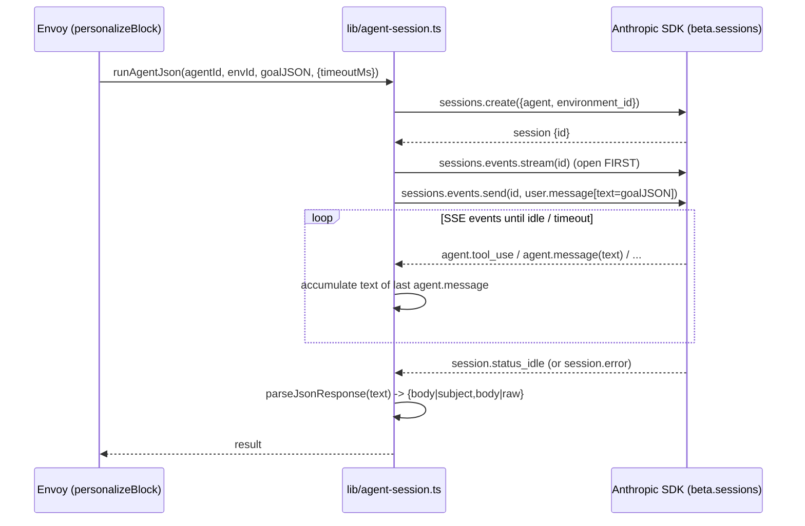
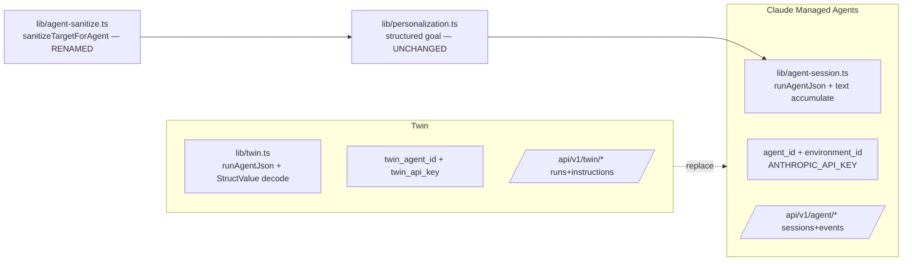

# refactor: Swap Twin (build.twin.so) for Claude Managed Agents

## Summary

Replace the Twin REST integration with **Claude Managed Agents** (`@anthropic-ai/sdk`, `client.beta.sessions`). The agent contract is unchanged — Envoy still sends a structured JSON goal (`{mode, original_content, prompt, target, block_type}`) and reads back `{body}` / `{subject, body}` — but the transport flips from Twin's "start run → poll events → decode nested `StructValue`" to Managed Agents' "create session → open SSE stream → send `user.message` → accumulate `agent.message` text → stop on `session.status_idle`". Per-org config moves from `twin_agent_id` + `twin_api_key` to `agent_id` + `environment_id`, auth moves from `TWIN_API_KEY` (`x-api-key` to build.twin.so) to a deployment-wide `ANTHROPIC_API_KEY` (the SDK default), and the settings UI + `/api/v1/twin/*` routes are rebuilt on Managed Agents primitives (`sessions.list`, `sessions.events.list`).

This is a rip-and-replace mirroring the prior AgentPlane→Twin swap, including its one-release deprecation-pointer convention. The personalization feature's behavior and the email pipeline are unchanged. Image generation (requested in some prompts) is **deferred** — Managed Agents' built-in toolset has no image generator.

---

## Problem Frame

Envoy personalizes email blocks (and generates content) by calling a managed AI agent. Today that agent runs on Twin (build.twin.so) via a bespoke REST client (`lib/twin.ts`): start a run, poll `/runs/{id}/events`, detect a deeply-nested capitalized `Finished` event, and decode the agent's output out of a protobuf-style `StructValue` tree. The business has decided to run the same agent on **Claude Managed Agents** instead.

**Driver — ⛔ SIGN-OFF BLOCKER (fill before Phase A):** this swap delivers no user-visible feature and drops two capabilities (per-org keys, see KTD4; plus the residency exposure in R-E), so the *why* is the load-bearing input for whether those regressions are acceptable. State the actual driver here — e.g. consolidation onto Anthropic, Twin cost/EOL, or vendor-risk reduction. Forced migration (Twin sunsetting) → regressions are accepted cost. Discretionary → each regression needs affirmative sign-off and is weighed against not migrating at all. *(Still a placeholder — the plan is not ready for sign-off until this is real. See the Pre-sign-off gate.)*

Managed Agents is a different shape: an **event-streamed session** model (`POST /v1/sessions` → SSE `/v1/sessions/{id}/events/stream` → `POST .../events`) with first-class `agent.message` text blocks, a clean `session.status_idle` terminal signal, and `sessions.list` / `sessions.events.list` for observability. The migration must preserve the agent contract and the personalization pipeline while swapping every Twin-specific seam: client, per-org config, env, DB columns, REST routes, settings UI, and tests.

**"The same agent" is not free — it must be built on Managed Agents first.** The existing personalization agent runs on Twin's harness: it parses the structured-goal `user_message` into `{mode, original_content, prompt, target, block_type}`, returns `{body}` / `{subject, body}`, and carries whatever enrichment tools Twin provisioned. A Managed Agent is a different runtime — its system prompt is fixed at agent-creation time and its tools are the built-in set (Bash, file ops, web search/fetch, MCP) plus any configured MCP/custom tools. There is therefore no pre-existing `agent_id` that reproduces today's behavior; an equivalent Managed Agent (system prompt + the structured-goal contract + any enrichment tools) must be **built and validated to return `{body}` from the structurally identical JSON goal** before the transport swap can be verified. This is the riskiest part of the project and is owned by **U0** below, not by a passive provisioning bullet.

---

## Requirements

- **R1.** Personalization (`personalizeBlock`) and content generation paths invoke the agent through Managed Agents and receive `{body}` / `{subject, body}`, with no change to the structured-goal input or the downstream email pipeline.
- **R2.** Per-org config stores and resolves a Managed Agents `agent_id` + `environment_id` (via `getAgentConfig`, U3), the `/api/v1/organization` PATCH/GET handle both fields (U7), and `/api/v1/setup` reports `agent_configured` (U7); auth uses a deployment-wide `ANTHROPIC_API_KEY` env var (U1). *(R2 is satisfied across U1 = auth env, U3 = storage/resolver, U7 = endpoints.)*
- **R3.** The AI Activity settings tab lists the agent's recent sessions (newest first) and a session-detail view shows that session's event timeline — rebuilt on `sessions.list` / `sessions.events.list`.
- **R4.** The agent-config settings tab edits `agent_id` + `environment_id`.
- **R5.** Output extraction tolerates the same cases the Twin path did: clean JSON, fenced ```json``` blocks, non-object JSON wrapped as `{raw}`, and empty output → typed error.
- **R6.** Errors map to sensible HTTP statuses; a missing/invalid `ANTHROPIC_API_KEY` or unconfigured org surfaces clearly (parity with `withTwinAgent`'s 503/error mapping, including the existing "upstream auth error must not look like a session expiry" fix).
- **R7.** The agent-invocation timeout stays at the current 10 minutes (configurable via `opts.timeoutMs`); the client must enforce it and clean up (`sessions.archive`) so the SSE read completes inside the cron's 800s `maxDuration` with margin (see Risk R-A) — the fit is an implementation responsibility, not an automatic property.
- **R8.** Twin is decommissioned: `lib/twin.ts`, the Twin routes, Twin env, and Twin DB columns are removed, with a one-release deprecation pointer on the old `/api/v1/twin/*` paths.
- **R9.** Test coverage is ported: the Managed Agents client (mocked SDK stream), rewired callers, routes, and settings components.

### Success criteria

- **U0 passed:** a real Managed Agent returns parseable `{body}` from the structurally identical structured goal (gates everything below).
- A sequence step with a personalization-enabled block sends, and the recipient's email shows agent-rewritten content (verified against the real `agent_id` + `environment_id`).
- A load check: one enrollment with several personalized blocks runs without rate-limit/timeout failures under concurrent sessions (Risk R-G).
- `npx tsc --noEmit` clean, `npx next build` clean, full vitest suite green.
- AI Activity tab shows the just-run sessions, newest first; clicking one shows its events; the Instructions tab loads + saves the agent's `system` prompt.

---

## Key Technical Decisions

- **KTD1 — Full rip-and-replace, not an adapter.** Mirror the AgentPlane→Twin precedent (see `CLAUDE.md`): new client module, new config columns, rebuilt routes/UI, delete `lib/twin.ts`. A thin adapter behind the existing interface was considered but rejected — Twin's run/poll/event-decode surface and Managed Agents' session/stream surface differ enough that an adapter would preserve genuinely dead transport code (`StructValue` decode, nested-event unwrapping) with no payoff.
  - **`existingRunId` is NOT dead — it is a live idempotency guard that needs a deliberate replacement (see U4b).** The sequence-scheduler persists a `twin_run_id` to `sequence_step_executions` *before* the long AI call (migration `040`, partial index `idx_step_executions_inflight_twin_run`, and `getInflightTwinRunId` / `setStepExecutionTwinRunId` / `clearStepExecutionTwinRunId` in `lib/queries/sequences.ts`) so that a Vercel function killed mid-run resumes the same run next tick instead of firing — and re-billing — a fresh one. Its own migration comment names the stakes: "double billing and (when `approval_required=false`) potential duplicate emails." Managed Agents sessions are billed per token, so dropping this silently is a cost-and-correctness regression, not a cleanup. U4b decides and implements the replacement; the column/index/functions are migrated or retired there, never just abandoned.
- **KTD2 — Invocation: one session per call, session-open-before-send.** Each `personalizeBlock` / generate call creates a fresh session (stateless personalize), opens the stream **first**, then sends the structured-goal JSON as a single `user.message` text block, and reads to `session.status_idle`. Open-before-send is required — the docs note only events emitted after the stream opens are delivered. Sessions are **not** deleted after use (their history powers the AI Activity tab; Managed Agents checkpoints idle sessions for 30 days — see Risk R-E on the retention trade-off). The structured-goal JSON payload is **structurally identical** to today's (same keys/values; verify the renamed sanitizer didn't drift — U4).
- **KTD3 — Output extraction is content-seeking, not positional.** Accumulate `agent.message` content blocks where `block.type === "text"`, keyed by message so each turn's full text is available. Do **not** trust "the last `agent.message` is the answer" — that bet breaks on (a) trailing commentary after the JSON ("Hope this helps!"), (b) a single logical message arriving as multiple SSE deltas, and (c) a `tool_result` being the final turn before idle. Instead, mirror the Twin `extractFinalOutput` *intent*: scan the accumulated `agent.message` texts **newest → oldest** and return the first one that `parseJsonResponse` resolves to an object carrying `body` (or `subject`+`body`); fall back to the last message's text, then to full concatenation, only if none parse. Feed the chosen text to the existing `parseJsonResponse` (kept verbatim) for fenced/`{raw}`/empty handling. No `StructValue` decoding, no nested-event unwrapping, no terminal-name guessing — `session.status_idle` is the explicit terminal and `session.error` the failure signal. This deletes the most fragile Twin code (`decodeTwinValue`, `unwrapEventPayload`, `eventLooksTerminal`) without replacing it with an equally fragile positional bet. **Confirm at implementation start** whether the SDK delivers `agent.message` consolidated or as `content_block_delta` fragments — that determines whether per-message accumulation needs delta-joining (see U2).
- **KTD4 — Per-org config = `agent_id` + `environment_id`; deployment-wide key.** Store both ids per org (`organizations.agent_id`, `organizations.environment_id`). `environment_id` is a **required** input to `sessions.create`; it falls back to `ANTHROPIC_DEFAULT_ENVIRONMENT_ID` when the org leaves it blank (one shared sandbox env across orgs is viable since each session still gets an isolated container). Drop the per-org API-key override (`twin_api_key`) — Managed Agents are tied to the Anthropic account behind `ANTHROPIC_API_KEY`, which the SDK reads from env by default. The two ids are not secret (they only resolve to anything with a valid `ANTHROPIC_API_KEY`), so unlike `twin_api_key` they can be returned to the client plainly — **confirm in U1's SDK check that no unauthenticated Managed Agents endpoint accepts a bare `agent_id`/`environment_id`**; if one does, treat the id as semi-secret and surface a boolean instead. **Add a `UNIQUE` constraint on `organizations.agent_id`** so two orgs cannot point at the same agent and read each other's sessions (see U3).
  - **DECISION REQUIRED — tenant-isolation regression.** Dropping `twin_api_key` collapses per-tenant credential, cost, and rate-limit isolation onto one deployment-wide `ANTHROPIC_API_KEY`. Under Twin, a compromised/over-volume org affected only itself; now one key leak exposes every org's session transcripts (sanitized recipient PII), one account quota throttles all tenants, and cost can't be attributed per org. For Envoy's single-operator deployment this is acceptable; for multi-tenant SaaS deployments it is a real regression. **Default chosen here:** ship deployment-wide and treat `ANTHROPIC_API_KEY` as a top-tier secret (never logged, including in `AgentError.detail`; rotation runbook). **Alternative if per-tenant isolation is needed:** keep an optional `organizations.anthropic_api_key` override column with the same never-leaves-the-server treatment `twin_api_key` had (the SDK accepts a per-call key). Settle before U3.
- **KTD5 — AI Activity rebuilt on `sessions.list`; Instructions tab kept on `agents.update`.** `sessions.list({ agent_id })` + `sessions.events.list(sessionId)` map cleanly to the runs-list and run-detail views. `sessions.list` already defaults to **`desc` (newest first)** in the SDK, so R3's ordering is free; `sessions.events.list` defaults to **`asc` (chronological)** — opposite default, so any code reading "the last event" must pin `order` explicitly (see U2/U6). The Twin **Instructions** editor (which PUT the agent's instruction text) **does** have a Managed Agents equivalent: the installed SDK exposes `client.beta.agents.update(agentId, { system })` (read back via `agents.retrieve(agentId).system`). The earlier "doc 404'd → drop the tab" conclusion was a research gap, not a real absence — and note the field is **`system`**, not `system_prompt`. **Decision: rebuild the Instructions tab on `agents.update({ system })` / `agents.retrieve().system`** (U6), preserving the `twin_instruction_updates` audit trail (who changed instructions, when) rather than orphaning it. No Console-link fallback.
- **KTD6 — Image generation deferred.** Managed Agents' built-in tools are Bash, file ops, web search/fetch, and MCP — no image generator, and `agent.message` content blocks observed are text-only. Prompts asking for images (e.g. items + country flag) will be honored as text/HTML only, parity with today. A future path (agent configured with an image-gen MCP/custom tool that returns a hosted URL Envoy embeds into Html blocks) is out of scope here.
- **KTD7 — Prompt caching is server-side; nothing to wire.** Managed Agents has built-in prompt caching and compaction (the `session.usage` object reports `cache_creation_input_tokens` / `cache_read_input_tokens`). No client-side cache_control blocks to add. Usage visibility in the AI Activity tab comes from `sessions.list` (each session object carries `usage`), **not** from the invocation path — so `runAgentSession` does **not** thread `usage` through its return value (no caller consumes it; there is no per-invocation cost-tracking sink in scope). `runAgentSession` returns `{ output, sessionId }` only.
- **KTD8 — One-release deprecation pointer.** Per the team's established convention (`CLAUDE.md`: the `app/api/v1/agentplane/[...path]` 410-Gone catch-all + `agentplane_configured` alias kept "for one release"), the old `/api/v1/twin/*` routes return 410 with an RFC 9457 Problem Detail pointing at `/api/v1/agent/*`, and `setup` keeps a `twin_configured` alias for `agent_configured` for one release.

---

## High-Level Technical Design

### Invocation sequence (replaces Twin's start-run → poll loop)



### Component swap



---

## Output Structure

New/renamed files (existing files modified in place are listed per-unit, not here):

```text
lib/
  agent-session.ts          # NEW — Managed Agents client (replaces lib/twin.ts)
  agent-sanitize.ts         # RENAMED from lib/twin-sanitize.ts (logic unchanged)
app/api/v1/agent/
  _helpers.ts               # NEW — withAgent wrapper (replaces twin/_helpers.ts)
  sessions/route.ts         # NEW — GET sessions list
  sessions/[sessionId]/route.ts  # NEW — GET session events (detail)
  instructions/route.ts     # NEW — GET/PUT agent system prompt (replaces twin/instructions)
app/api/v1/twin/[...path]/route.ts  # NEW — 410 Gone deprecation pointer (one release)
components/settings/
  AgentConfig.tsx           # RENAMED/REWRITTEN from TwinAgentConfig.tsx
  AgentActivityList.tsx     # RENAMED/REWRITTEN from TwinRunsList.tsx
  AgentInstructions.tsx     # REBUILT from TwinInstructions.tsx (on agents.update)
migrations/
  044_managed_agents_config.sql  # NEW — rename/add columns + UNIQUE(agent_id)
  045_session_resume.sql         # NEW — twin_run_id → agent_session_id (or drop) — U4b
scripts/
  agent-diagnose.ts         # REWRITTEN from scripts/twin-diagnose.ts
```

---

## Implementation Units

Grouped into three phases: **Foundation** (client + config), **Rewire** (callers + routes), **UI + Cleanup**.

### Phase A — Foundation

### U0. Build & validate the Managed Agent (prerequisite — blocks U2's success check)

**Goal:** Stand up a Managed Agent on the Anthropic account that reproduces today's personalization contract, and prove it returns `{body}` from the structurally identical structured-goal JSON before any Envoy transport code depends on it.
**Requirements:** R1 (the contract this whole plan preserves).
**Dependencies:** none — this is the true first step; U1–U9 assume its `agent_id` + `environment_id` exist.
**Files:** none in this repo (Anthropic-side provisioning + a throwaway spike script driven by `scripts/agent-diagnose.ts`'s eventual shape). Record the resulting `agent_id` + `environment_id` for U1/U3 config.
**Approach:**
- Create the Managed Agent with a system prompt that implements the structured-goal protocol: read the `user.message` text as JSON `{mode, original_content, prompt, target, block_type}`, personalize, and return **only** `{body}` (or `{subject, body}` for the generate path). This is a prompt/tooling rebuild — the Twin agent's behavior does not port automatically.
- Reattach any enrichment tools the Twin agent relied on (web search/fetch or an MCP tool) needed to honor prompts like "use their company"; image generation stays out (KTD6).
- Create (or reuse) one `environment_id` for the account.
- Spike: run one real session end-to-end with a **synthetic** fixture target (no real recipient PII; the transcript must not be committed to source control) and assert the returned text parses to `{ body }`.
- **The spike must CAPTURE and RECORD the real SDK lifecycle shapes — not just pass a `{body}` round-trip.** These are the load-bearing facts U2/U4b/U5 are coded against (currently prose-sourced — Risk R-F). Record:
  - the literal event `type` discriminator strings actually observed (`agent.message`, `session.status_idle`, `session.error`, `agent.tool_use`, …);
  - whether `agent.message` text arrives **consolidated** or as `content_block_delta` fragments (decides whether U2 must delta-join — KTD3);
  - whether `session.agent_id` (or whatever key ties a session to its agent) is present on the `sessions.retrieve` payload (the U5 IDOR guard depends on it);
  - the **billing/lifecycle boundary**: does `sessions.create` bill, or only `events.send`? When the SSE stream drops mid-turn, does the server-side run **continue to completion (re-observable later via `sessions.events.list`)** or **abort**? And are an idle session's events **durable** after the stream closes? (These three answers decide whether U4b's harvest-resume is sound or must fall back to at-least-once — see U4b.)
- **Quality gate, not just shape:** run an enrichment-dependent fixture (e.g. a prompt relying on "use their company") through both the Twin agent and the new Managed Agent and require a side-by-side human/LLM judgment that personalization quality is **comparable** — a parseable `{body}` that is blander or drops enrichment is a silent product regression a hard cutover (U8) would hide.
**Test scenarios:** `Test expectation: none -- provisioning + manual spike; the gate is "a real session returns parseable, quality-comparable {body}" AND "the recorded SDK-shape checklist above is captured".`
**Verification:** a recorded `agent_id` + `environment_id`, a captured (synthetic) transcript showing `{body}` out of the structured goal in, the SDK-shape checklist filled, and the quality-parity judgment. **U2 must not write its mocked tests, and the U2/U4b success checks must not start, until this capture lands** (it supersedes guessing the shapes from docs).

### U1. Add Anthropic SDK + environment config

**Goal:** Install `@anthropic-ai/sdk`; add `ANTHROPIC_API_KEY` (required) and optional `ANTHROPIC_DEFAULT_ENVIRONMENT_ID`; remove `TWIN_API_KEY` / `TWIN_API_URL`.
**Requirements:** R2.
**Dependencies:** none.
**Files:** `package.json`, `lib/env.ts`, `.env.example`, `CLAUDE.md`, `test/setup.ts` (swap env defaults).
**Approach:** Add the dep **pinned to an exact version** (the integration is gated behind the dated beta header `managed-agents-2026-04-01`; a floating range risks a silent surface change). On install, open `node_modules/@anthropic-ai/sdk` type defs and **verify the real surface** the plan codes against — `client.beta.sessions.create/list`, `sessions.events.stream/send/list`, `sessions.retrieve/archive`, the `session.status_idle` / `session.error` / `agent.message` event discriminators, `client.beta.agents.update/retrieve` (param `system`), and crucially **whether the `sessions.retrieve` payload carries the owning agent id** (`session.agent_id` or equivalent) — the U5 IDOR guard depends on it; if absent, U5 falls back to list-membership. The runtime lifecycle questions (does `sessions.create` bill or only `events.send`; does an SSE drop abort the server-side run; are idle-session events durable; consolidated vs `content_block_delta` delivery) are **not answerable from type defs** — they're captured by U0's real-session spike, which U2/U4b depend on. The plan's method names were sourced from prose docs (some 404'd) and were not confirmed against installed types — reconcile any drift here before U2 writes its tests against the imagined shape. Make `ANTHROPIC_DEFAULT_ENVIRONMENT_ID` **required in production** (`getEnv()` fail-fast outside `ENVIRONMENT=dev`) so an org with `agent_id` set but `environment_id` blank can't silently resolve to `undefined` (see U3 / Risk R-C). In `lib/env.ts`, add `ANTHROPIC_API_KEY: z.string().min(1)` and `ANTHROPIC_DEFAULT_ENVIRONMENT_ID` (required in prod, optional in dev via superRefine); remove the two `TWIN_*` keys and the https-only superRefine that targeted `TWIN_API_URL`. The SDK reads `ANTHROPIC_API_KEY` from env automatically, but validating it in `getEnv()` keeps the fail-fast behavior. Update `test/setup.ts` so the suite has `ANTHROPIC_API_KEY` + `ANTHROPIC_DEFAULT_ENVIRONMENT_ID` defaults (mirrors the old `TWIN_API_KEY` default).
**Patterns to follow:** existing `getEnv()` lazy-validation in `lib/env.ts`.
**Test scenarios:**
- `getEnv()` throws when `ANTHROPIC_API_KEY` is missing/empty. (env validation test if one exists; else `Test expectation: none -- config-only, covered transitively by client tests`.)

### U2. Managed Agents session client (`lib/agent-session.ts`)

**Goal:** New client replacing `lib/twin.ts`: `runAgentSession(agentId, environmentId, userMessage, opts) -> { output, sessionId }` and `runAgentJson(...) -> Record<string, unknown>`, plus an `AgentError` type and HTTP-status mapping.
**Requirements:** R1, R5, R6, R7.
**Dependencies:** U1; U0 (a real `agent_id` must exist before the success-criteria check, not before writing the mocked tests).
**Files:** `lib/agent-session.ts` (new), `test/lib/agent-session.test.ts` (new). Reuse: copy `parseJsonResponse` from `lib/twin.ts` verbatim (the fenced/`{raw}`/empty logic is transport-agnostic).
**Approach:**
- Singleton `Anthropic` client (reads `ANTHROPIC_API_KEY`).
- `runAgentSession`: `sessions.create({ agent: agentId, environment_id })`; open `sessions.events.stream(session.id)` **before** `sessions.events.send(session.id, { events: [{ type: "user.message", content: [{ type: "text", text: userMessage }] }] })`; iterate the async stream accumulating text from `agent.message` blocks (`block.type === "text"`) **into a per-message list** (so the whole conversation's messages are available, not just the running tail); break on `session.status_idle`; on `session.error` throw `AgentError(event.error?.message, 502)`.
- Extraction (per KTD3, content-seeking): scan the accumulated message texts **newest → oldest**, returning the first that `parseJsonResponse` resolves to an object with `body` (or `subject`+`body`); else fall back to the last message text, then full concat. Verify whether `agent.message` arrives consolidated or as `content_block_delta` fragments — if fragmented, join deltas per message id before parsing.
- Timeout: race the stream loop against `opts.timeoutMs` (default 10 min). On timeout, **primary cleanup = `sessions.archive(id)`** (terminates the session so it can't keep billing); if `archive` isn't accepted on a running session, swallow the error. Then throw `AgentError(504)`. Cleanup is best-effort — its failure never changes the thrown error.
- Transient-error handling: retry `sessions.create` on `429` with bounded exponential backoff (port the 429-retry the old `twinFetch` had — `lib/twin.ts` retried 429 with `retry-after`; this client dropped it and must not). Do not retry non-idempotent `events.send`.
- `runAgentJson` = `runAgentSession` then `parseJsonResponse(output)`.
- `AgentError extends Error { status; detail? }`, mapping SDK `APIError.status` through; surface upstream-auth (401/403 from Anthropic) as 502 so it never reads as an Envoy session expiry (preserve the `withTwinAgent` 401→502 lesson — see `app/api/v1/twin/_helpers.ts`).
**Patterns to follow:** the kept `parseJsonResponse` and `TwinError`→`AgentError` shape from `lib/twin.ts`; the streaming loop shape from the Managed Agents TS docs (open stream, then send, `for await`).
**Technical design (directional, not spec):**
```text
runAgentSession:
  session = sessions.create({agent, environment_id})    # retry 429 w/ backoff
  stream  = sessions.events.stream(session.id)          # open first
  sessions.events.send(session.id, user.message[text])
  messages = []                                         # per-message text, in order
  for await event of withDeadline(stream, timeoutMs):   # on deadline: archive(id); throw 504
    agent.message     -> messages.push(join(text blocks))   # join deltas per msg id if fragmented
    session.status_idle-> break
    session.error      -> throw AgentError(502, event.error?.message)
  # content-seek newest->oldest for the first parseable {body|subject,body}
  output = firstParseableWithBody(reverse(messages))
        ?? last(messages) ?? join(messages)
  return { output, sessionId: session.id }
```
**Test scenarios:** (mock the SDK — `vi.mock("@anthropic-ai/sdk")` returning a fake `beta.sessions` whose `events.stream` yields a scripted async iterator)
- Happy path: stream yields `agent.message(text='{"body":"X"}')` then `session.status_idle` → `runAgentJson` returns `{ body: "X" }`; asserts stream opened before send (call order) and `user.message` carried the exact `userMessage` text.
- `{subject, body}` object output parses through.
- Fenced ```json``` text output parses through.
- Non-object JSON (`'"str"'`) → `{ raw }`.
- Empty output (idle with no `agent.message`) → throws `AgentError` status 502.
- `session.error` event → throws `AgentError` 502 with the error message as detail.
- Intermediate `agent.message` reasoning followed by a final JSON `agent.message` → returns the parseable JSON message, not the reasoning. (Covers content-seek.)
- **Trailing commentary**: final `agent.message` is `"Hope this helps!"` after an earlier `{"body":"X"}` message → content-seek returns `{ body: "X" }`, not the commentary. (This is the case positional "last message" would get wrong.)
- **Split delta**: a single logical message arrives as two `content_block_delta` fragments (`'{"body":"'` then `'X"}'`) → joined per message id and parses to `{ body: "X" }`.
- **Tool-result final turn**: stream ends with a tool/`agent.tool_use` result then `session.status_idle` (no concluding `agent.message`) → content-seek still finds the earlier JSON message.
- Timeout: stream never idles within `timeoutMs` → throws `AgentError` 504 (use `vi.useFakeTimers()`); asserts `sessions.archive` attempted on timeout but its failure doesn't change the thrown error.
- `429` from `sessions.create` → retried with backoff, then succeeds (assert retry happened); exhausted retries → `AgentError`.
- Upstream 401/403 from `sessions.create` → mapped to 502 (not surfaced as 401).

### U3. Per-org agent config: migration + queries

**Goal:** Replace `twin_agent_id`/`twin_api_key` with `agent_id` + `environment_id`; resolver `getAgentConfig(orgId) -> { agentId, environmentId } | null`.
**Requirements:** R2, R4.
**Dependencies:** none (can land with U1/U2).
**Files:** `migrations/044_managed_agents_config.sql` (new), `lib/queries/organization.ts`, `test/lib/queries/organization.test.ts`.
**Approach:**
- Migration `044`: `RENAME COLUMN twin_agent_id TO agent_id` (wrap in a `DO`/`information_schema` guard per `CLAUDE.md`'s non-idempotent-rename rule), `ADD COLUMN environment_id TEXT`, `DROP COLUMN twin_api_key`, and **`NULL` out every renamed `agent_id`** — the carried-over values are *Twin* agent ids that do not exist on the Anthropic account, and leaving them makes orgs *look* configured (they'd pass the `agent_id IS NOT NULL` cron gate, see U4) while every `sessions.create` fails. Forcing reconfiguration is the safe default; a known Twin→Managed mapping can backfill instead if one exists. Add a **`UNIQUE` constraint on `agent_id`** (partial, `WHERE agent_id IS NOT NULL`) so two orgs can't share an agent and read each other's sessions (Security). Update `ALLOWED_UPDATE_COLUMNS` to `agent_id`, `environment_id`. **This migration's scope is `organizations` only** — `sequence_step_executions.twin_run_id` (from migration `040`) is owned by U4b, not here; do not leave it stranded.
- Replace `getTwinAgentId` + `resolveTwinApiKey` with `getAgentConfig(orgId)`: `SELECT agent_id, environment_id` scoped by org; `environmentId` falls back to `getEnv().ANTHROPIC_DEFAULT_ENVIRONMENT_ID` when null. **Return null (treat as unconfigured → 503) when EITHER `agent_id` OR the resolved `environment_id` is null** — `environment_id` is required by `sessions.create`, so a configured-agent/no-env org must surface as "not configured," never as a 502 on every call. `getOrganization` now selects `agent_id` + `environment_id` plainly (no masking — ids aren't secret; drop the `twin_api_key_configured` boolean).
**Patterns to follow:** existing `getTwinAgentId` / `resolveTwinApiKey` shape and the `ALLOWED_UPDATE_COLUMNS` mass-assignment guard in `lib/queries/organization.ts`.
**Test scenarios:**
- `getAgentConfig` returns `{agentId, environmentId}` when both set.
- Falls back to `ANTHROPIC_DEFAULT_ENVIRONMENT_ID` when `environment_id` null.
- Returns null when `agent_id` null/row missing.
- **Returns null when `agent_id` set but `environment_id` null AND no `ANTHROPIC_DEFAULT_ENVIRONMENT_ID` (configured-agent/no-env → unconfigured, not a 502).**
- `updateOrganization` accepts `agent_id`/`environment_id`, rejects unknown columns (mass-assignment guard preserved).
- Setting an `agent_id` already held by another org violates the UNIQUE constraint (surfaced as a 409 at the route, see U7).
- `getOrganization` SELECT includes `agent_id` + `environment_id` and no longer references `twin_api_key`.

### Phase B — Rewire callers + routes

### U4. Rewire agent callers to the session client

**Goal:** Point every Twin caller at `lib/agent-session.ts`, passing `agentId` + `environmentId`. Personalization's structured-goal payload is unchanged.
**Requirements:** R1.
**Dependencies:** U2, U3.
**Files:** `lib/personalization.ts`, `lib/queries/system.ts`, `app/api/cron/sequence-scheduler/route.ts`, `app/api/cron/campaign-executor/route.ts`, `app/api/v1/content/generate/route.ts`, `app/api/v1/content/generate-to-outbox/route.ts`, `lib/mcp-tools.ts`, `lib/agent-sanitize.ts` (rename from `lib/twin-sanitize.ts`), plus their tests.
**Approach:**
- Rename `lib/twin-sanitize.ts` → `lib/agent-sanitize.ts` and `sanitizeTargetForTwin` → `sanitizeTargetForAgent` (logic unchanged); update imports. (Pure rename — low risk, keeps the PII allowlist gate.)
- `personalizeBlock` (`lib/personalization.ts`): swap `runAgentJson` import to `lib/agent-session`; thread `environmentId` through `processPersonalization` alongside `agentId`. Structured goal `{mode, original_content, prompt, target: sanitizeTargetForAgent(...), block_type}` is unchanged.
- **`lib/queries/system.ts` (REQUIRED — not optional):** `claimScheduledCampaigns` filters `AND o.twin_agent_id IS NOT NULL` and both it and `getDueEnrollments` `SELECT o.twin_agent_id, o.twin_api_key`. After migration `044` these column names no longer exist → a hard runtime SQL error that stops all campaigns and sequence enrollments. Change the filter to `o.agent_id IS NOT NULL` and the SELECTs to `o.agent_id, o.environment_id` (drop `twin_api_key`).
- Crons read `agent_id` + `environment_id` off the joined org row. Update the **positional** dereference/call sites that this changes: `campaign-executor` passing `campaign.twin_agent_id` → `campaign.agent_id` + `environment_id` into `executeCampaign`/`generateContent`; both content routes' `generateContent(agentId, …)` calls; `mcp-tools`. Per `CLAUDE.md`, `toHaveBeenCalledWith` assertions are positional — update each caller and its test together.
- `generateContent` in the new client mirrors the old signature but takes `environmentId` (new signature: `generateContent(agentId, environmentId, target, contentType)`).
- MCP tools `generate_email_content` / `preview_block_personalization`: resolve `getAgentConfig` instead of `getTwinAgentId`/`resolveTwinApiKey`.
**Patterns to follow:** existing per-org-config threading documented in `CLAUDE.md` ("Per-Org Twin API Key" section — now per-org agent+env); the `withTwinAgent`→`withAgent` wrapper (U5) for route handlers.
**Execution note:** keep the structured-goal JSON **structurally identical** (same keys, same `sanitizeTargetForAgent` output as the old `sanitizeTargetForTwin` — verify the rename changed no field names or values); a diff of the `user_message`/`user.message` text before vs after should show only transport changes. Any drift in the sanitizer changes the agent's input and can change its output quality.
**Test scenarios:**
- `personalizeBlock` sends the structured goal `{mode, original_content, prompt, target, block_type}` (sanitized target) as the `user.message` text and applies the returned `body` to the block.
- Sanitizer rename: target allowlist still drops internal fields / clamps lengths (port `test/lib/twin-sanitize.test.ts`).
- `generateContent` includes content type + target in the payload (port the existing assertion).
- MCP tool resolves `getAgentConfig` and 503s/early-returns when unconfigured.
- Integration: a personalization-enabled block with a mocked session run updates the block; a disabled block is skipped.

### U4b. Crash-resume idempotency for the sequence-scheduler

**Goal:** Replace the Twin `existingRunId` crash-resume so a Vercel function killed mid-AI-call does not re-bill (and possibly re-send) on the next tick — and retire the now-stale `twin_run_id` machinery instead of leaving it stranded.
**Requirements:** R1 (correctness of the generate-from-scratch path), R8 (decommission).
**Dependencies:** U2, U3, U4.
**Files:** `app/api/cron/sequence-scheduler/route.ts`, `lib/queries/sequences.ts` (the three inflight functions), `migrations/045_session_resume.sql` (new), plus tests `test/lib/queries/sequences.test.ts`, `test/app/api/cron/sequence-scheduler.test.ts`.
**Approach:** Today the scheduler persists `sequence_step_executions.twin_run_id` *before* the long call (migration `040` + partial index `idx_step_executions_inflight_twin_run`) via `setStepExecutionTwinRunId`, resumes via `getInflightTwinRunId` + `runAgentJson({ existingRunId })`, and clears via `clearStepExecutionTwinRunId`. The Twin guarantee held because `startRun` returns a re-pollable `run_id` **synchronously, before any billed work**. Managed Agents splits that into `sessions.create` → open stream → `events.send(user.message)` (the billed turn), which opens **three** crash windows the design must be honest about:
1. crash after `create`, before `events.send` — harvested session has no events; resuming means `events.send` into the same session (first billed turn — not a double-bill);
2. crash after `events.send`, before idle — recoverable **only if** dropping the SSE stream does NOT abort the server-side run and its events are durable; otherwise resume must re-send = a double-billed turn;
3. crash after idle, before the DB clear — harvest works (the clean case).
**Which path is sound depends on U0's recorded lifecycle answers** (does the SSE drop abort the turn? are idle-session events durable? does `events.send` into an existing no-output session bill once?). So:
- **(Preferred, IF U0 confirms server-side runs survive an SSE drop and events are durable) Persist `session_id`, harvest on retry.** Migration `045`: `RENAME COLUMN twin_run_id TO agent_session_id` (+ rename the partial index). Persist `session.id` **after `sessions.create` and before `events.send`** (the marker must precede the billed turn); on the next tick, if a row has an inflight `agent_session_id`, `sessions.retrieve(id)` + `sessions.events.list(id)` to harvest `{body}`; if the session has no output events yet, re-`events.send` **into the same session** (not a new `sessions.create`); clear on success. This preserves the double-bill guard for windows 1 & 3 and (given the U0 confirmation) window 2.
- **(Fallback, IF U0 shows SSE-drop aborts the run or events aren't durable) Accept at-least-once.** Drop the column/index/functions in migration `045` and document the regression: a mid-run crash re-bills one session and (when `approval_required=false`) can re-send. Requires explicit sign-off because it changes billing/duplicate-send behavior.
- **Personalization path is at-least-once regardless.** `processPersonalization` (the high-fan-out path, ~25 concurrent blocks per R-G) has **no** inflight marker today and this unit does not add one — under sandbox-per-call billing, a mid-tick crash re-runs every in-flight block. State this explicitly; the `getDueEnrollments` 10-minute reclaim window bounds it to roughly one retry, which is likely acceptable, but it must be a named decision, not a silent carry-forward.
Either way, the `twin_run_id` column, its index, and `getInflightTwinRunId`/`setStepExecutionTwinRunId`/`clearStepExecutionTwinRunId` are migrated or removed here — never abandoned. (U8's grep-sweep must include `twin_run_id`.)
**Patterns to follow:** the existing inflight-tracking protocol in `app/api/cron/sequence-scheduler/route.ts` and `lib/queries/sequences.ts`; migration `040_twin_run_id.sql` for the column/index shape.
**Test scenarios:**
- Preferred path: a row with an inflight `agent_session_id` and a *completed* session resumes by harvesting `sessions.events.list` rather than creating a new session (assert no `sessions.create`).
- Window 1: marker persisted, crash before `events.send`, resume re-sends **into the same session** (assert no second `sessions.create`).
- Marker is persisted after `sessions.create` and **before** `events.send`, and cleared after success.
- Fallback path (if chosen): no inflight column remains; the cron tolerates a re-run (documented at-least-once).

### U5. Agent route wrapper + REST routes; deprecate `/api/v1/twin/*`

**Goal:** New `app/api/v1/agent/*` routes for the settings UI (sessions list, session detail, instructions) behind a `withAgent` wrapper; old Twin routes return 410 with a pointer.
**Requirements:** R3, R4, R6, R8.
**Dependencies:** U2, U3.
**Files:** `app/api/v1/agent/_helpers.ts` (new), `app/api/v1/agent/sessions/route.ts` (new, GET), `app/api/v1/agent/sessions/[sessionId]/route.ts` (new, GET events), `app/api/v1/agent/instructions/route.ts` (new, GET via `agents.retrieve().system` + PUT via `agents.update({ system })`, preserving the `twin_instruction_updates` audit insert — replaces `app/api/v1/twin/instructions/route.ts`), `app/api/v1/twin/[...path]/route.ts` (new, 410 catch-all) replacing the old twin route files, `test/app/api/v1/agent/routes.test.ts` (new, port from `test/app/api/v1/twin/routes.test.ts`).
**Approach:**
- `withAgent(request, fn)`: `requireAdmin` → resolve `getAgentConfig(tenantId)` → 503 when unconfigured → `fn({ agentId, environmentId, tenantId, auth })`, mapping `AgentError` to its status (and 401/403→502, preserving the logout-loop fix). Mirrors `app/api/v1/twin/_helpers.ts` — **keep `auth` in the context** (the Twin wrapper exposes it); the instructions PUT needs `auth.userId` + `auth.tenantId` to write the `twin_instruction_updates` audit row (`user_id` is `NOT NULL`), and dropping `auth` would silently produce an empty audit trail.
- `GET /api/v1/agent/sessions?limit=` → `sessions.list({ agent_id })`, return `{ sessions, ... }` (id, status, created_at, usage).
- `GET /api/v1/agent/sessions/[sessionId]` → return the event timeline, but **verify ownership Envoy-side first, do not delegate to Anthropic.** Because all orgs share one `ANTHROPIC_API_KEY`, the Anthropic API will happily return any session on the account regardless of which agent created it — so calling `sessions.events.list(sessionId)` directly is an IDOR (session ids are shown in `AgentActivityList`, giving an oracle). Before listing events, confirm the session belongs to the requesting org's `agent_id`. The mechanism depends on a field U0 must confirm exists: if `sessions.retrieve(sessionId)` carries the owning agent (`session.agent_id`), assert `session.agent_id === agentId`, else `404`. **Fail closed:** if the field is missing/`undefined`, treat it as not-owned (`404`), never as a pass. If `retrieve` does **not** expose the owning agent, fall back to the Twin `assertRunBelongsToAgent` mechanism — `sessions.list({ agent_id })` and confirm the requested id is a member of the org's own list (server-enforced filter) before `events.list`. (Twin used list-membership, not field-equality — `lib/twin.ts` `assertRunBelongsToAgent`.) This is the real teeth behind the cross-tenant isolation, given the shared `ANTHROPIC_API_KEY`.
- `GET/PUT /api/v1/agent/instructions` → `agents.retrieve(agentId).system` / `agents.update(agentId, { system })`; the PUT keeps the audit insert into `twin_instruction_updates` (who/when) from the old Twin instructions route.
- Delete the old twin route files; add `app/api/v1/twin/[...path]/route.ts` returning **410** with an RFC 9457 Problem Detail pointing at `/api/v1/agent/*` (mirror the `app/api/v1/agentplane/[...path]` precedent in `CLAUDE.md`).
**Patterns to follow:** `app/api/v1/twin/_helpers.ts` (`withTwinAgent` shape, 503 + `TwinError` mapping + 401→502), `requireAdmin`/`isErrorResponse` guard pattern, the agentplane 410 catch-all.
**Test scenarios:**
- `withAgent` forwards 401 from `requireAdmin`; returns 503 when org has no `agent_id`; surfaces `AgentError` status; maps a 401 `AgentError` to 502.
- `GET /sessions` returns the listed sessions for the org's agent; rejects under-scoped tokens (port the scope checks).
- `GET /sessions/[id]` returns events; **`sessions.retrieve` is called and a session whose `agent_id` ≠ the org's agent → 404** (IDOR guard, not delegated to Anthropic); a session with a **missing/undefined** owning-agent field → also `404` (fail closed, not open).
- `GET/PUT /agent/instructions` reads/writes the agent `system`; PUT writes a `twin_instruction_updates` audit row **with the correct `user_id` + `organization_id` from `auth`** (regression guard for the dropped-`auth` bug).
- `/api/v1/twin/<anything>` → 410 with a Problem Detail pointing at `/api/v1/agent`.

### Phase C — UI + Cleanup

### U6. Settings UI: agent config, activity list, session detail

**Goal:** Rebuild the three Twin settings surfaces on Managed Agents data.
**Requirements:** R3, R4.
**Dependencies:** U5, U7 (`AgentConfig` PATCHes `/organization`, which U7 wires).
**Files:** `components/settings/AgentConfig.tsx` (rewrite of `TwinAgentConfig.tsx`), `components/settings/AgentActivityList.tsx` (rewrite of `TwinRunsList.tsx`), `app/(admin)/settings/page.tsx` (tab wiring + labels), `app/(admin)/settings/runs/[runId]/page.tsx` → session-detail page (events timeline), `components/settings/AgentInstructions.tsx` (rebuild of `TwinInstructions.tsx` on `agents.update({ system })` — see KTD5; the `app/api/v1/agent/instructions/route.ts` backend route it calls is owned by U5, not duplicated here), and ported tests `test/components/AgentConfig.test.tsx`, `test/components/AgentActivityList.test.tsx`, `test/components/AgentInstructions.test.tsx`.
**Approach:**
- `AgentConfig`: two text inputs — `agent_id` and `environment_id` — PATCHing `/organization`, no secret masking (drop the `twin_api_key` password field and `twin_api_key_configured` logic). **Each input needs a placeholder showing the id format and one line of help** ("from the Anthropic Console") so a non-technical admin knows what to paste; `environment_id` help must state that blank = use the deployment default. Preserve the `hasChanges`/save-disabled affordance per field; treat an emptied `environment_id` as "clear override → use default," not a null PATCH of a required value. **Surface load-failure and save-failure states inline** (the current component has a save error but no initial-load error state — add one with retry). **A `409` from PATCH** (agent_id already used by another org, U7) renders a distinct inline error on the `agent_id` field: "This agent ID is already in use by another organization. Enter a different agent ID." — not a generic save-error toast.
- `AgentActivityList`: fetch `/agent/sessions`. `sessions.list` is already `desc` (KTD5); keep the client-side newest-first sort (commit `c97d9be`) as a belt-and-braces default. Specify the **row + status vocabulary**: Managed Agents session statuses are `idle` / `running` / `error` (map → badge variants: idle/finished→default, running→secondary, error→destructive); row shows id, status, created_at. States: loading, empty, transient-error, **and a distinct "no agent configured" state** (the route 503s when `agent_id` is unset) that links to the agent-config tab rather than rendering a raw 503. **Detect the "no agent configured" state by HTTP 503 status code**, not by parsing the error body; all other non-2xx are transient-error.
- Session-detail page: fetch `/agent/sessions/[id]`. Surface the **final `agent.message` text as a "result" block at the top** (what the admin actually came to see), then the raw event timeline (type, processed_at, text snippet) below as `<details>`. **While the fetch is in flight, render a loading skeleton in the result-block region and skeleton rows in the timeline** (don't leave the result region blank — that reads as an error). Define the empty-events state ("No events recorded"). Header shows session id + status + created_at (the Twin `run_number`/`event_count`/`step_count` fields don't exist on sessions).
- Instructions tab: **rebuild** `AgentInstructions` on `GET/PUT /api/v1/agent/instructions` (KTD5) — load `system`, edit, save, keep the audit trail. Do **not** drop the tab or add a Console-link fallback. Specify its states like `AgentConfig`: **load-error with retry** (and a "Agent not configured — go to the Agent Config tab" message on a `503`), **save-error inline**, and an **empty-`system`** state (textarea placeholder "No system prompt set").
- Tab wiring: the existing tab uses `value="instructions"` and `?tab=instructions`. Keep that slug (the config + instructions live under the renamed "Agent" tab) so existing bookmarks/links don't 404 into the `email` fallback; only the label changes ("Twin agent" → "Agent").
**Patterns to follow:** existing `TwinAgentConfig.tsx`/`TwinRunsList.tsx`/`TwinInstructions.tsx` structure and the settings tab wiring in `app/(admin)/settings/page.tsx`; the newest-first ordering and `statusBadge()` map already in `TwinRunsList.tsx`; the audit-insert in `app/api/v1/twin/instructions/route.ts`.
**Test scenarios:**
- `AgentConfig` loads `agent_id`/`environment_id`, Save PATCHes only changed fields, no secret field rendered; initial-load error renders an inline error+retry; save error renders inline; a `409` renders the "already in use" message on the `agent_id` field.
- `AgentActivityList` renders one row per session newest-first; status→badge mapping for idle/running/error; loading, empty, transient-error, and "no agent configured" (503-by-status) states each render distinctly.
- Session-detail shows a loading skeleton, then the final-message result block, the event timeline, and an empty-events state.
- `AgentInstructions` loads `system`, Save PUTs it and writes an audit row; load-error (and 503 "configure first"), save-error, and empty-`system` states render.

### U7. Organization route + setup status

**Goal:** `/api/v1/organization` PATCH/GET handle `agent_id` + `environment_id`; `/api/v1/setup` reports `agent_configured` (+ one-release `twin_configured` alias).
**Requirements:** R2 (org-endpoint contract for the per-org ids), R8.
**Dependencies:** U3.
**Phase note:** logically Phase-B route work (parallel to U5), grouped under Phase C only because it lands alongside the UI that consumes it — no UI/cleanup dependency of its own.
**Files:** `app/api/v1/organization/route.ts`, `app/api/v1/setup/route.ts`, `lib/schemas.ts` (org schema), tests `test/app/api/v1/organization.test.ts`, `test/app/api/v1/setup.test.ts`.
**Approach:** PATCH accepts `agent_id`/`environment_id` (string|null → set/unconfigure; non-string → 400), maps the query-layer "Unknown field" throw to 400, and maps the `agent_id` **UNIQUE-violation** (U3) to **409** ("agent already in use"). GET returns them plainly. `setup` returns `agent_configured = !!agentId` with `twin_configured` aliased to the same value for one release.
**Patterns to follow:** the existing organization PATCH validation + "Unknown field"→400 mapping in `app/api/v1/organization/route.ts`.
**Test scenarios:**
- PATCH sets trimmed `agent_id`/`environment_id`; null/empty unconfigure; non-string → 400; combined update.
- PATCH of an `agent_id` already held by another org → 409.
- GET returns `agent_id`/`environment_id`, no `twin_api_key*` keys.
- `setup` returns `agent_configured` and the `twin_configured` alias.

### U8. Decommission Twin

**Goal:** Remove Twin code/env/columns/diagnostic now that all callers are migrated.
**Requirements:** R8.
**Dependencies:** U4, U4b, U5, U6, U7.
**Files:** delete `lib/twin.ts`, `app/api/v1/twin/_helpers.ts`, `app/api/v1/twin/instructions/route.ts`, `app/api/v1/twin/runs/route.ts`, `app/api/v1/twin/runs/[runId]/route.ts` (the four confirmed files under `app/api/v1/twin/`); `components/settings/TwinInstructions.tsx` is **replaced by `AgentInstructions.tsx` in U6**, not deleted here. `scripts/twin-diagnose.ts` → rewrite to `scripts/agent-diagnose.ts`; grep-sweep `CLAUDE.md`, `README.md`, `.env.example`, **and `twin_run_id`** for Twin references.
**Approach:** Mechanical removal after the rewire lands. Keep `parseJsonResponse` (it moved to `lib/agent-session.ts` in U2). Rewrite the diagnostic to drive a Managed Agents session end-to-end and print the extracted `{body}` (mirrors the value of `scripts/twin-diagnose.ts`).
**Rollback posture — DECISION REQUIRED (and it constrains U3's migration shape — settle before Phase A).** Deleting `lib/twin.ts` in the same change that ships the unverified beta integration leaves no fallback if Managed Agents misbehaves under production load (the R-B extraction bet, R-A long SSE, R-G scale). Note the tension: a staged provider switch and U3/U4b's *destructive* migrations (`DROP twin_api_key`, `RENAME twin_agent_id→agent_id` + NULL, `RENAME twin_run_id→agent_session_id`) **cannot both land first** — once those run, `lib/twin.ts` has no columns to read and can't actually run in prod. So the two real postures are:
- **(Recommended) Staged cutover with ADDITIVE migration.** Make migration `044`/`045` additive-only during the canary window: **add** `agent_id`/`environment_id`/`agent_session_id` alongside the Twin columns, and do **not** drop/rename/NULL anything until the U8 follow-up. Keep `lib/twin.ts` behind an `AGENT_PROVIDER=twin|managed` switch; the canary org resolves the new columns, everyone else resolves the Twin columns; once `managed` is proven, a *second* migration drops the Twin columns and U8 deletes the code. This is the only staged path whose schema actually supports both providers. (Trade-off: two migrations + a transitional dual-column window.)
- **(Alternative) Hard cutover (current single-migration plan).** Destructive migration + delete now; the real rollback is `git revert` + a down-migration, **not** a provider switch (the switch is non-functional once the destructive migration lands — don't imply otherwise). Acceptable only if U0's spike + the U2 success check give enough confidence to forgo a live fallback. Note: a personalization regression ships degraded email content to real recipients before it's noticed (see U0's quality gate).
**Patterns to follow:** the AgentPlane removal pattern in git history.
**Test scenarios:** `Test expectation: none -- deletion unit; suite-green + tsc + build are the verification.` Verify no remaining imports of `@/lib/twin` (a grep gate in the unit's verification).

### U9. Test + docs sweep

**Goal:** Ensure the ported suite is green and docs match.
**Requirements:** R9.
**Dependencies:** U1–U8.
**Files:** `test/setup.ts`, any stragglers under `test/**` referencing Twin, `CLAUDE.md`, `README.md`.
**Approach:** Delete `test/lib/twin.test.ts`, `test/app/api/v1/twin/routes.test.ts`, `test/components/Twin*.test.tsx` once replaced; confirm `test/lib/twin-sanitize.test.ts` ported to `agent-sanitize`, the `AgentInstructions` + `agent/instructions` route tests exist (U5/U6), and `lib/queries/system.ts`'s column rename is covered (U4). Update `CLAUDE.md`'s integration sections (Twin→Managed Agents, env vars incl. `ANTHROPIC_API_KEY`/`ANTHROPIC_DEFAULT_ENVIRONMENT_ID`, route table, settings UI, the per-org-key section → per-org agent+env, and migrations note for `044`/`045`).
**Patterns to follow:** the existing `vi.mock("@/lib/db", ...)` and `mockFetchQueue` conventions; mock `@anthropic-ai/sdk` for client/route tests.
**Test scenarios:** `Test expectation: none -- meta unit; the gate is full vitest green + tsc + build.`

---

## Scope Boundaries

### In scope
- Transport swap (client, config, env, columns, routes, settings UI, tests) preserving the agent contract and personalization pipeline.
- One-release deprecation pointers on `/api/v1/twin/*` and the `twin_configured` setup alias.

### Deferred to Follow-Up Work
- **Image generation** in personalized blocks (KTD6) — needs an image-gen tool/MCP on the agent + Envoy hosting/embedding image URLs.
- **Content/campaign `{subject, body}` from scratch** still requires an agent built for it; the EasyCarnet agent only personalizes (returns `{body}`) — unchanged by this swap.
- **Session cleanup policy** (archive/delete old sessions to control retention/cost **and PII retention** — see Risk R-E) — sessions are kept for AI Activity; this is both a cost and a data-residency concern, and the erasure-request path (`sessions.archive`/`delete`) may need to land sooner than "if volume warrants."
- **Rename `twin_instruction_updates` table** → `agent_instruction_updates`. **Intentionally retained Twin-branded for now** (renaming a live audit table mid-swap adds risk for no functional gain); the new instructions route writes to it unchanged. A follow-up migration can `RENAME TABLE` (with the `information_schema` guard) once the swap is stable. This is the one Twin-branded DB artifact deliberately *not* decommissioned in U8 — a conscious keep, not an oversight.

### Pre-sign-off gate (resolve BEFORE Phase A — these change scope or ship something irreversible)
- **Migration driver (Problem Frame):** fill the placeholder with the real reason (forced Twin EOL vs. discretionary consolidation). It's the input that makes the three regressions below acceptable-by-necessity or scrutiny-worthy; the plan is not sign-off-ready while it's blank.
- **Tenant-credential isolation (KTD4):** ship deployment-wide `ANTHROPIC_API_KEY` (default) **or** add an optional per-org `anthropic_api_key` override. This changes U3's migration shape (extra column + resolver), not a within-unit toggle — pick before U3 is written.
- **Rollback posture (U8):** staged `AGENT_PROVIDER` cutover with an **additive** migration (recommended) vs. hard cutover with a destructive migration. This changes U3/U4b's migration shape (additive vs destructive) and the release plan — pick before Phase A, not at U8.
- **PII residency (R-E):** business sign-off that Managed Agents' ~30-day server-side retention (not ZDR/HIPAA) is acceptable for Envoy's recipients.

### Implementation-time decisions (resolve during the named unit, gated on U0's captured SDK shapes)
- **Crash-resume strategy (U4b):** harvest-resume (preferred) vs. at-least-once — the choice is gated on U0's answers (SSE-drop abort? events durable?). Settle at U4b.
- **`agent.message` delivery shape (KTD3/U2):** consolidated vs `content_block_delta` fragments — captured by U0's spike; determines whether U2 delta-joins.
- **Session-ownership field (U5):** whether `sessions.retrieve` carries the owning agent id (field-equality guard) or U5 falls back to list-membership — captured by U0/U1.

**Resolved during this review** (no longer open):
- *Agent instructions editing:* `client.beta.agents.update(agentId, { system })` / `agents.retrieve().system` exist in the installed SDK — U6 rebuilds the tab on them (field is `system`, not `system_prompt`).
- *`sessions.list` ordering:* defaults to `desc` (newest first); `sessions.events.list` defaults to `asc`. No client-side ordering guesswork needed beyond pinning `events.list` order where "last event" matters.

---

## Risks & Dependencies

- **R-A — SSE streaming inside a Vercel cron.** The session stream is a long-lived SSE read held open for the whole agent run (up to 10 min). The cron's 800s `maxDuration` is **not** an automatic guarantee the 10-min call fits — it's a responsibility: the stream loop must enforce `opts.timeoutMs` and `sessions.archive`-cleanup so cleanup completes inside 800s (≈200s margin) and a hung run can't pin the function. With `MAX_CONCURRENT_PROCESSING = 5` blocks each holding a 10-min stream, one enrollment can consume most of the window — consider a per-block timeout below 600s so cleanup has margin. Verify the SDK stream works under the Node serverless runtime (no edge-only assumptions; the SDK `Stream` is a plain fetch-body async-iterator, so this is expected to hold).
- **R-B — Output shape assumption.** "Last `agent.message` = the JSON answer" is the core extraction bet. Mitigation: `parseJsonResponse` already tolerates fenced/`{raw}`; the unit test for intermediate-reasoning-then-final-JSON locks the behavior; validate against a real agent in the success-criteria check before merging.
- **R-C — Migration of existing orgs (silent-failure trap).** Renaming `twin_agent_id`→`agent_id` would *preserve* values that are Twin ids invalid on the Anthropic account — making orgs *look* configured (they pass the `agent_id IS NOT NULL` cron gate) while every `sessions.create` fails, and in the cron that failure is swallowed (logged, retried-and-failed each tick) → "personalization silently stopped for all orgs," discovered via missing emails. Plus `environment_id` is required by `sessions.create`, so an org with an agent but no env (and no default) fails the same way. Mitigations (now in the plan): U3 migration **NULLs the renamed `agent_id`s** so unconfigured orgs surface cleanly; `getAgentConfig` returns null (→503) when `environment_id` is unresolved; `ANTHROPIC_DEFAULT_ENVIRONMENT_ID` is **required in prod** (U1 fail-fast). Run the migration on prod with a Neon backup branch (team convention).
- **R-D — Beta API churn.** Managed Agents is beta (`managed-agents-2026-04-01`); event shapes may shift. Mitigation: isolate all SDK contact in `lib/agent-session.ts` and pin the SDK to an exact version (U1). Note the **header value itself** is a dated string — a future dated beta that deprecates this one is an *ops* event (header bump + redeploy), not a one-file code fix; record the beta header in one constant.
- **R-E — Data residency & retention (PII to a third party).** Sanitized recipient PII (name, email, company, role, phone, and clamped metadata via `sanitizeTargetForAgent`) is sent to Anthropic Managed Agents, which **stores session transcripts server-side ~30 days** (KTD2 deliberately does not delete them — they power AI Activity) and is **not ZDR/HIPAA-eligible**. This is a change in which third party retains recipient PII and for how long; Twin's per-org key at least scoped that per tenant. Obligations this creates: a data-subject erasure request now requires deleting Anthropic sessions (use `sessions.archive`/`sessions.delete`), and self-hosters who had a DPA with Twin have no relationship with Anthropic. Mitigations / decisions: keep the allowlist sanitizer as the only PII gate (preserved); decide a retention/cleanup policy (a cleanup cron may belong in-scope rather than deferred, given one-session-per-call volume); never log session content in `agent-diagnose.ts` or `AgentError.detail`. **Get business sign-off that Managed Agents' retention posture is acceptable for Envoy's users before cutover.**
- **R-F — SDK surface was unverified at planning time.** `@anthropic-ai/sdk` was not installed when this plan was written; the session/agent method names and event discriminators came from prose docs (the agents page 404'd). If the real types differ, every mocked test in U2/U5 is written against the wrong shape and U2 (the foundation) blocks everything. Mitigation: U1 installs + reconciles types and U0 runs one real session as a spike — treat both as a gate before U2's tests are written.
- **R-G — Per-call session fan-out at scale.** One Managed Agents session per `personalizeBlock`/generate call, each spinning an isolated sandbox container, means a single cron tick can open many concurrent sessions (sequence-scheduler: up to `MAX_CONCURRENT_PROCESSING (5)` enrollments × `maxConcurrent (5)` blocks = ~25; campaign-executor fans `MAX_CONCURRENT_CALLS (10)`). Twin's start-run+poll was lightweight; sandbox cold-start adds latency that erodes the 10-min and 800s budgets, and Anthropic enforces sessions/min + tokens/min rate limits the Twin path never hit. Mitigation: U2 adds 429 backoff (restoring the retry the old `twinFetch` had — but note backoff only *serializes* against a rate limit, it doesn't raise it, and the ported `~100ms·4^n × 3` exhausts in ~27s → a burst of failures, not graceful degradation). So treat the arithmetic as an **a-priori deliverable, not a load-test discovery**: get the account's sessions/min limit and compute whether `MAX_CONCURRENT_PROCESSING × maxConcurrent` (~25) sessions can start within it; if not, lower `MAX_CONCURRENT_*` to a *computed* value or add a semaphore around `sessions.create` (a U2/U4 task with a number, not a parenthetical). Then still validate under load during the success-criteria check (one enrollment with several personalized blocks).
- **Dependency (owner: Envoy team, before the success-criteria check — tracked by U0):** a valid `agent_id` + `environment_id` provisioned on the Anthropic account (U0), and `ANTHROPIC_API_KEY` set in Vercel. The plan now owns provisioning via U0 rather than treating it as an external given.

---

## Sources & Research

- Claude Managed Agents — overview, sessions, events-and-streaming, environments, session-operations (platform.claude.com/docs/en/managed-agents/*). Established: env created once + reused; `sessions.create({agent, environment_id})`; open stream before send; `agent.message` text blocks; `session.status_idle` terminal + `stop_reason`; `session.error`; `sessions.list({agent_id})`, `sessions.events.list(id)`, `sessions.retrieve/archive/delete`; `session.usage` (built-in prompt caching); `x-api-key: ANTHROPIC_API_KEY` + `anthropic-beta: managed-agents-2026-04-01` (SDK sets beta auto); built-in tools = Bash/file ops/web/MCP (no image gen); checkpoints expire after 30 days.
- Agents API (instructions get/update) — the doc page 404'd during planning, but the **installed SDK confirms** `client.beta.agents.update(agentId, { system })` and `agents.retrieve(agentId).system` (field is `system`, not `system_prompt`). The Instructions tab is rebuilt on these (KTD5). **Caveat (R-F):** the rest of the `beta.sessions`/`beta.agents` surface this plan codes against must still be reconciled against the installed type defs in U1 — method names came from prose docs, not from `node_modules`.
- Internal: AgentPlane→Twin migration convention (one-release 410 + alias) per `CLAUDE.md`; the Twin output-extraction + 401→502 + timeout learnings live in commits `acaffb1`, `72ee674`, `3a27969`/`58122f4` (no `docs/solutions/` entries yet — capture via `/ce-compound` after this lands).
